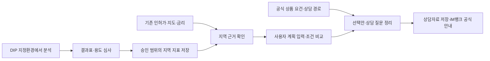

# 해커톤 데이터 확보 목록 — 발급처·API·센터 반출·활용 방향

> 작성: 2026-09-18
> 대상 서비스: **창업자금 사전상담 → 조건 변경·비교 → 상담자료 → iM뱅크 공식 상담 안내**
> 근거: 첨부 [데이터 설명서(2026.09)][catalog]·[이용정책(2024.02)][policy], 현재 코드 및 기존 조사 기록. 아래 PDF 쪽수는 PDF 페이지 기준이다.
> 관련 문서: [플랫폼 전환 계획](2026-09-18-imbank-consultation-plan.md) · [문제 정의](problem.md) · [기존 API 조사](apilist.md)
> 상태: **확보·검증할 항목을 정리한 계획**이다. 새 데이터 수령, 반출 승인, 키 발급, 은행 제휴를 완료했다는 뜻이 아니다. 기존 보유 상태도 문서·코드 기록 기준이며 이번에 DB·실제 키를 재검증하지 않았다.

## 1. 한눈에 보는 활용 데이터

**사용자 입력으로 자금계획을 계산하고, 지역 자료로 가정을 점검하며, 공식 금융상품 정보로 상담을 준비한다. 센터의 카드·생활인구 결과는 지역 근거를 보강한다.**

U·F·P·D 번호는 각각 사용자·금융기관·공공/API·센터 자료의 식별자다. 우선순위는 ‘필수·유지·센터 우선’ 표시를 따른다.

| 구분 | 확보처 | 사용할 데이터 | 확보 방법 | 화면에서 보여줄 것 | 현재 할 일 |
|---|---|---|---|---|---|
| **필수 U1** | 사용자 | 월세·투자비·자기자본·희망대출·매출 가정 | 직접 입력 | **필요 매출·준비자금·조건 변경 전후** | 입력·가정·미확인 값 구분 |
| **필수 F1** | iM뱅크 | 상품 조건·선행 절차·공식 상담 경로 | 공식 웹자료 확인 | **선택한 계획으로 은행에 확인할 내용** | 기존 상품 3건의 최신 원문·연결 근거 확인 |
| **필수 F2** | 대구신보·정책자금 운영기관 | 보증·지원 요건·취급은행·신청 순서 | 공식 공고 확인 | **보증·확인서 등 먼저 확인할 절차** | 기존 보증 5건·정책/청년 4건 재검토 |
| **유지 P1** | 행정안전부 / 공공데이터포털 | 7업종 인허가·영업상태·개폐업 이력 | 기존 API | **동네 업종·개폐업 현황** | 적재 자료의 기준일·분류 검증 |
| **지도 유지 P2** | 브이월드 | 지도 타일·지역 경계 | 기존 API | **지역 선택·동별 지표 지도** | 키·도메인·지역 코드 확인 |
| **유지 P3** | 한국은행 ECOS | 기준금리·대출금리 통계 | 기존 API | **금리 가정의 출처·기준월** | 최신 적재값과 대체값 구분 |
| **유지 P4** | 기업마당 | 창업·소상공인 지원사업 공고 | 기존 API | **지원정보·신청기간·공식 원문** | 만료 여부·지역 조건 확인 |
| **센터 우선 D1** | DIP 경유 삼성카드 | 동·업종별 소비 특성 | **센터 분석 → 심사 → 결과표 반출** | **소비 변화·주말 비중·소비자 구성** | 최신 반출 기준부터 확인 |
| **센터 우선 D2** | DIP 경유 SKT | 동별 생활인구 특성 | **센터 분석 → 심사 → 결과표 반출** | **시간대·거주/직장/방문인구 특성** | 파일별 기간·집계 정의 확인 |

**센터 방문·이용 시 우선 요청할 것은 D1·D2 두 종류다.** 나머지 센터 자료는 §3의 조건에 해당할 때 추가한다. 센터 결과가 늦어져도 U1·F1·F2와 기존 공공데이터로 핵심 동선을 완성한다.

## 2. 발급처별 필수·기존 데이터와 API

아래 API는 현재 코드 또는 기존 조사에 기록된 연결이다. 키 보유 기록과 현재 호출 성공은 구분한다. 별도 표시가 없으면 신규 발급보다 기존 권한·키의 유효성 확인을 먼저 한다.

### U1. 사용자 — 실제 창업 계획

| 항목 | 받을 내용 | 활용 방향 |
|---|---|---|
| 가게를 여는 비용 | 보증금·권리금·인테리어·설비비 | 초기 투자비 계산 |
| 운영 비용·매출 가정 | 월세·인건비·보험료·원가율·수수료율·예상 월매출 | 손익분기 매출·시나리오 계산 |
| 조달 가정 | 자기자본·미확보 희망대출·금리 | 자금 구성·조달 필요·희망대출 반영 후 부족액 구분 |
| 상담 정보 | 사업자등록 여부·업력·개업 예정일·자금 필요일·연령(선택)·보증/확인서 진행 상태 | 창업 단계에 맞는 상담 질문 |
| 입력의 근거 | 견적·계약 검토값·추정값·모름, 조건 변경 이유 | 상담자료에 가정과 남은 확인 사항 표시 |

- **확보 방식:** 우리 입력폼. 외부 API·키 불필요.
- **센터 자료로 대체할 수 없는 부분:** 후보 점포의 실제 계약 조건과 개인 자금 상황. 공시지가를 월세로, 지역 소비를 개인 점포 매출로 대체하지 않는다.

### F1. iM뱅크 — 상품과 공식 상담 목적지

| 구분 | 내용 |
|---|---|
| 확보처 | [iM뱅크 공식 홈페이지](https://www.imbank.co.kr/)의 상품 설명·상담·영업점 안내. 기존 조사 원문 예: [소상공인 정책자금 안내](https://www.imbank.co.kr/cms/fnm/loan/product/giup/01/sda_41216/1221451_5612.html) |
| 받을/정리할 항목 | 상품명·대상·등록/업력 요건·용도·한도·금리 안내·보증 필요 여부·선행 절차·서류·공식 URL·확인일·미확인 사항 |
| 방식·API | **공식 자료를 확인해 수기 JSON 관리. 이번 공식 채널 안내에는 은행 API 키 불필요** |
| 활용 | 조달 필요의 목적·시점에 맞는 상담 주제와 공식 상담 경로 표시 |
| 현재 상태 | `data/manual/imbank_products.json` 3건. 일부 조사 출처는 보도자료이므로 공식 원문으로 보강 필요 |
| 완료 기준 | iM뱅크 취급 근거와 상담 목적지가 확인됨. 확인되지 않으면 일반 상담 질문·공식 안내로 연결 |

은행 제휴는 없다. 링크 이동은 상담 예약·자료 전송·대출 접수가 아니다. 특정 상품이 현재 접수 가능하거나 예비창업자가 신청 가능하다고 파일 존재만으로 판단하지 않는다.

### F2. 대구신용보증재단·정책자금 운영기관 — 보증·지원 절차

| 확보처 | 정리할 데이터 | 활용 방향 | 방식·상태 |
|---|---|---|---|
| [대구신용보증재단](https://www.dgsinbo.or.kr/) | 보증 대상·지역·창업 단계·한도·보증료·서류·취급은행·신청 절차 | 은행 상담 전 확인할 보증 요건, iM뱅크 연계 근거 | 공식 공고 수기 확인. `dgsinbo_products.json` 5건 재검토 |
| 소진공·중진공·대구시 등 **각 공고의 실제 운영기관** | 정책자금/지원사업 대상·신청기간·추천/확인서 여부·접수처·취급기관 | 지원사업과 은행 상담의 실제 순서 설명 | `daegu_youth_startup.json` 4건 및 공고 원문의 공식 링크에서 추적 |

- **API:** 이번 범위에 새 기관 API 필수 없음. 기업마당·온통청년 API는 공고 탐색을 보조하며 최종 요건은 해당 원문으로 확인한다.
- **공통 결과물:** 상품별 `bank_connection`, 연결 근거 URL, 등록 필요 여부, `prerequisites`, `application_steps`, `documents`, `verified_at`를 정리한다. 상세 계약은 [전환 계획 §5-2](2026-09-18-imbank-consultation-plan.md#5-2-상품의-상담용-메타데이터)를 따른다.
- 보증상품이 있다는 이유만으로 iM뱅크 취급을 부여하거나, 지원금·대출·보증의 한도를 합산해 확보 자금으로 표시하지 않는다.

### P1~P4. 공공데이터·지도·금리·지원공고 — 기존 연결 유지

| ID·확보처 | 데이터·현재 연결 | 필요한 항목 | API·키 | 활용·확인 사항 |
|---|---|---|---|---|
| **P1 행안부 / [공공데이터포털](https://www.data.go.kr/)** | 일반음식점·휴게음식점·미용·체력단련장·당구장·노래연습장·PC방 인허가. 기존 수집 경로 `https://apis.data.go.kr/1741000/{slug}/info` | 관리번호·업종·인허가일·폐업일·영업상태·주소·좌표·갱신시점 | `DATA_GO_KR_API_KEY`. 개별 API 활용 권한 확인 | 기존 DB·지역 지표 재사용. 날짜·단기 종료 분류 검증 후 개폐업 현황 설명 |
| **P2 [브이월드](https://www.vworld.kr/)** | 기존 WFS·Data API와 WMTS 타일 | 지역 코드·명칭·경계·좌표계·경계 기준시점 | 서버 `VWORLD_API_KEY`, 브라우저 `NEXT_PUBLIC_VWORLD_KEY` | 지역 선택·지표 지도. 행정동/법정동·센터 코드와의 대응 확인, 운영 도메인에서 표시 검증 |
| **P3 [한국은행 ECOS](https://ecos.bok.or.kr/api/)** | 코드상 `StatisticSearch`, `722Y001` 기준금리·`121Y006` 대출금리 계열 | 통계 계열·월·금리·단위·출처 | `ECOS_API_KEY` | 금리 가정 초깃값·민감도 계산 참고. 개인 적용금리와 구분. 조회 실패 시 기존 4.5%는 예시 가정으로 표시 |
| **P4 [기업마당](https://www.bizinfo.go.kr/)** | 기존 `https://www.bizinfo.go.kr/uss/rss/bizinfoApi.do` | 공고명·기관·대상·지역·기간·지원내용·원문 URL | `BIZINFO_API_KEY` | 지원정보 검색·AI 설명 근거. 신청 가능 여부·은행 취급을 검색 결과만으로 확정하지 않음 |

인허가·지역 집계 등은 보유·사용 기록이 있다. 기존 DB를 읽을 때마다 외부 API를 재호출할 필요는 없다. 이번에는 **어떤 시점의 자료가 화면과 리포트에 쓰이는지** 먼저 맞춘다.

## 3. DIP 빅데이터활용센터 — 분석 후 반출할 목록

**이용 창구:** [대구 빅데이터활용센터](https://dipbigdata.kr/). 첨부 이용정책 3쪽은 대구ID 이용 신청 → 분석 → 반출요청 → 심사를 안내한다. 실제 접속·방문 방식과 최신 신청 절차는 센터에 확인한다.

**API 여부:** 첨부 문서에는 우리 서버가 원본을 조회하는 공개 API·키 발급 경로가 제시돼 있지 않다. 아래 자료는 **센터 지정환경에서 분석하고 승인 결과를 받는 방식**으로 계획한다. 단순 다운로드나 자동 갱신 API로 취급하지 않는다.

### D1. 삼성카드 — 동·업종별 소비 특성 [우선 요청]

| 항목 | 내용 |
|---|---|
| 원 제공기관 / 신청 창구 | 삼성카드 / DIP 센터 |
| 설명서 근거 | **18쪽**, 2024.01~2025.12, 대구 지역 소비 자료 |
| 센터에서 사용할 컬럼 | `기준년월`, `가맹점_행정동`, `업종명_대분류`, `업종명_중분류`, `내외지인`, `성별`, `연령대`, `WEEK_GROUP`, `WEEKEND_GROUP`, `AMT`, `CNT` |
| 우선 분석 범위 | 시연할 동·업종을 우선 확정하고, **2024~2025년 같은 카드사·같은 분류**로 비교. 대상 업종과 카드사 중분류의 대응을 확인 |
| 반출 요청 결과 | 동·업종·월별 소비 변화 지표, 평일/주말 소비 비중, 필요할 때 성연령·내외지인별 구성비. 산식·기간·단위·제공 범위를 함께 요청 |
| 활용 화면 | 지역 참고 카드, AI의 매출 가정 확인 질문, 상담자료의 지역 근거 |
| 사용자에게 줄 도움 | ‘주말 매출을 중심으로 계획했는데, 해당 지역 자료를 보고 어떤 수요를 더 확인해야 하는가’ |
| 승인 상태 | **미신청·미확보. 2024년 반출표에 삼성카드 개별 항목이 없어 최신 기준 확인이 선행** |

결과표 파일명 제안: `dip_card_context.csv` 또는 센터가 승인하는 동등한 형식. 파일명·형식 모두 제안이며 현재 제공 파일이 아니다. 최소 구성은 `지역 식별값 / 업종·분류 / 기간 / 지표명 / 값 / 단위 / 산식 / 출처 / 제한사항`이다.

`AMT ÷ CNT`는 정의 확인 후 이용건당 금액의 근거가 될 수 있지만 점포당 월매출이 아니다. 위 표에는 점포 수가 없다. 카드 소비를 개별 점포 예상 매출이나 전체 시장 매출로 자동 환산하지 않는다.

### D2. SKT 생활인구 — 동별 시간대·인구 구성 [우선 요청]

| 항목 | 내용 |
|---|---|
| 원 제공기관 / 신청 창구 | SK텔레콤 / DIP 센터 |
| 설명서 근거 | **54~58쪽**. 전체 소개는 2020.01~2026.07이며 파일별 종료월·누락 기간은 다름 |
| 센터에서 사용할 컬럼 | `HCODE`, `STD_YMD`, `TIME`, `H_POP`, `W_POP`, `V_POP`; 파일에 따라 `H_T_*`, `W_T_*`, `V_T_*`, 성연령 항목, `BLOCK_CD` |
| 우선 분석 범위 | D1과 비교하는 자료는 **공통으로 존재하는 2024~2025 기간**부터 확인. 2026 자료는 별도 최신 배경으로 구분 |
| 반출 요청 결과 | 동·월별 거주/직장/방문인구 구성과 동·시간대별 평균 수준 또는 상대적 분포. 평균·구성비 산식과 분모를 명시 |
| 활용 화면 | ‘지역의 시간대 특성’ 카드, 영업시간·목표 고객 가정을 점검하는 질문 |
| 사용자에게 줄 도움 | ‘점심 중심 운영을 계획했는데 직장인구와 방문인구의 시간대 특성을 어떻게 참고할 것인가’ |
| 승인 상태 | **미신청·미확보. 정책 4~5쪽에 통계처리·공간결합 최소 동 단위와 심사 절차 명시** |

결과표 파일명 제안: `dip_population_context.csv` 또는 승인된 동등 형식. 최소 구성은 `행정동 식별값 / 기간 / 시간대 / 인구 구분 / 통계값 / 집계 방식 / 출처 / 제한사항`이다.

셀→동 매핑은 센터 안에서 처리할 수 있는지 먼저 확인한다. 소블록 원본·개별 좌표를 가져오는 것을 필수로 두지 않는다. 시간대·날짜별 인구를 단순 합산해 중복 없는 방문자 수나 구매 고객 수로 설명하지 않는다.

### D3~D5. 필요할 때만 추가할 센터 자료

| ID·자료 / 근거 | 추가하는 조건 | 센터에서 분석할 항목 | 반출 요청 결과·활용 | 제한 |
|---|---|---|---|---|
| **D3 상권 공간 자료**, 설명서 4~5·93~94쪽 | 기존 공공자료로 주변 업종·시설 설명이 부족할 때 | 업종별 상가 수·주차장·대규모점포 등 격자 결합값 | 승인 단위의 업종·시설 분포 → 지역 환경 참고 | 공공데이터 결합 자료도 정책 6쪽은 통계처리·결합·시각화로 표시. 격자 파일 그대로 반출 가능하다고 보지 않음. 개폐업 이력·월세 대체 불가 |
| **D4 다른 카드사 자료**, 설명서 7~17쪽 | D1 이용이 어렵거나 특정 관광상권을 시연할 때 | 신한: 관광지·행정동·업종·금액/건수. KB/현대: 업종·시간대·성연령 소비 | 해당 카드사·기간 안에서 소비 특성 산출 → 대체 지역 근거 | 신한 2021.01~2024.10 관광지 중심, KB 2020.01~2021.07, 현대 2017.01~2022.08. 카드사를 이어 붙여 하나의 연속 추이로 만들지 않음 |
| **D5 대구로 주문**, 설명서 3·81~85쪽 | 배달 중심 창업을 별도 시연할 때 | 주문일시·완료/취소 상태·금액·가맹점 소재 동·포장 여부 | 동별 시간대 주문 분포·포장 비중 등 → 배달 운영 가정 참고 | 목록상 2022~2023. 고객 거주 동과 가맹점 동 구분. 주문-결제 연결키 확인 후 분석. 대구로 내 비중을 전체 배달시장 점유율로 표현하지 않음 |

D4는 정책 5쪽의 해당 카드사 반출 범위, D5는 정책 6쪽의 배달앱 자료 범위와 현재 세부 데이터 적용 여부를 확인한다. 모두 심사 전에는 확보로 표시하지 않는다.

### 센터 자료에서 이번에 요청하지 않을 항목

| 자료 | 이번 요청에서 제외하는 이유 |
|---|---|
| 리뷰 원문·블로그 본문을 우리 RAG에 적재 | 정책 5쪽의 해당 리뷰·블로그 자료는 시각화만 허용 표시. 텍스트 반출을 전제할 수 없음 |
| 신용보증기금 기업별 재무·식별정보 | 설명서 110~111쪽은 기존 기업 재무자료. 예비창업자의 실제 자금·상환능력을 대신하지 않음 |
| 북구·달성군 50Cell 유동인구 상품 | 설명서 105쪽에 샘플만 존재한다고 명시. 대구 전체 서비스의 완전한 기반으로 쓰지 않음 |
| 개인·점포별 원본 카드/주문 내역, 원본 소블록 경계 | 현재 핵심 경험은 동별 참고 통계로 성립. 반출 제한 자료를 필수 의존성으로 두지 않음 |

## 4. 보조 자료·AI API의 확보 여부

| 확보처 | 데이터·기능 | 방법·키 | 현재 판단·활용 |
|---|---|---|---|
| [온통청년](https://www.youthcenter.go.kr/) | 청년 창업 지원공고 | 기존 `https://www.youthcenter.go.kr/go/ythip/getPlcy`, `YOUTHCENTER_API_KEY` | 보유·수집 기록 있음. 청년 대상 안내를 넣을 때 갱신. 기존 키 재발급 과제의 처리 여부 확인 |
| [행안부 주민등록 인구통계](https://jumin.mois.go.kr/) | 행정동별 주민등록 인구·연령 구성 | 기존 파일 수집·CSV. 이 방식은 새 API 키 불필요 | 적재 기록 있음. 인구 카드 채택 시 연결. SKT 생활인구·방문객 수와 별도 지표로 표시 |
| [D-데이터허브](https://data.daegu.go.kr/) | 먹거리골목·전통시장 등 지역 시설 | 공식 공개파일, 항목별 제공 방식 확인 | 지역 배경 설명이 필요할 때만 추가. 센터 민간자료를 대체하는 공개 원본으로 오인하지 않음 |
| [한국부동산원 R-ONE](https://www.reb.or.kr/r-one/) | 상권 단위 임대료·공실 통계 | 기존 `RONE_API_KEY` | 적재 기록 있으나 월세 자동 입력은 미연결. 이번에는 실제 월세 직접 입력 우선 |
| [Google AI Studio](https://aistudio.google.com/api-keys) | AI 설명·질문·상담자료 작성, RAG 임베딩 | **기존 `GEMINI_API_KEY`** | AI 기능에는 필요. 새 지역 데이터 공급원이 아님. 생성·임베딩 호출과 키 유형 점검은 [전환 계획 §10](2026-09-18-imbank-consultation-plan.md#10-api-키추가-데이터-확보-계획) 참조 |

**이번에 새 필수 키로 지정하지 않는 것:** 은행 예약/신청 API, 금융감독원 금융상품 공시 API, 네이버·카카오 지도, KOSIS·SGIS·공정위 API. 필요 데이터의 제공 범위와 실제 추가 기능을 확정한 뒤 검토한다. 뉴스는 현재 코드의 Google RSS 경로를 유지하며 새 뉴스 키가 필요하지 않다.

## 5. 센터에 가져갈 반출 요청서 구성

### 5-1. 신청할 분석 과제

> 대구 예비창업자의 계약 전 자금계획 점검을 위해, 선택한 행정동·업종의 소비 특성과 생활인구 특성을 분석합니다. 개인·가맹점 식별 원본을 외부로 가져오지 않고, 승인된 동 단위 이상의 통계 결과를 지역 참고자료로 사용하려 합니다. 사용자 비용·매출 가정에 따른 재무 계산은 별도로 수행합니다.

| 요청 묶음 | 반출 신청할 것 | 사용할 곳 |
|---|---|---|
| **A 소비 결과표** | D1의 소비 변화·주말 비중 등 필요한 지표와 산식 | 지역 카드·상담자료 |
| **B 생활인구 결과표** | D2의 동별 시간대·인구 구성 통계와 집계 정의 | 지역 카드·입력 가정 점검 |
| **C 설명자료** | 데이터셋명·원 제공기관·기간·업종/지역 분류·누락/제외 기준·산식·분석 코드·한계 | 출처 표시·재현·AI 설명 범위 관리 |

파일 형식은 **CSV/XLSX 등 수치표를 우선 요청**하되 허용 여부를 확인한다. 이미지로만 승인되면 승인된 이미지·설명자료를 표시하고, 허용받지 않은 수치표를 이미지에서 복원하는 대안으로 삼지 않는다.

### 5-2. 신청 전에 확인할 사항

- [ ] **이용:** D1 삼성카드·D2 SKT의 실제 제공 파일, 대상 지역·업종·기간, 센터 접속/방문 방식과 이용 일정.
- [ ] **반출:** 최신 반출정책, 삼성카드 적용 기준, 동×업종×월 등 세부 집계 수준, 소수 표본 처리 기준, CSV/XLSX 허용 여부.
- [ ] **사용 목적:** 해커톤 발표·영상뿐 아니라 공개 웹사이트의 표시/서버 저장, 상담자료 다운로드, 코드 제출에 데이터를 포함할 수 있는 범위.
- [ ] **외부 AI:** 승인 결과를 Gemini에 보내 설명하도록 하는 사용이 허용되는지. 불명확하면 센터 수치를 전송하지 않고, 허용된 화면 표시와 사용자 재무 계산 설명으로 분리.
- [ ] **절차:** 담당자 심사와 필요시 제공기관 추가 심사, 반출 예상 일정, 변경된 결과를 다시 반출할 때의 절차.

정책 2~4쪽의 근거는 **폐쇄망 분석·외부 인터넷 불가·심사 후 반출·출처 표시·공급자 계약별 기준**이다. 정책 4쪽은 카드/통신 자료의 최소 동 단위를 명시한다. ‘동 단위이므로 자동 승인’, ‘반출 승인으로 공개 서비스·AI 사용도 모두 허용’이라고 확대하지 않는다. 첨부 정책은 2024년판이므로 신규 자료 적용은 센터 확인이 필요하다.

## 6. 받은 결과를 플랫폼에 붙이는 방법

- **지역 결과표는 사전에 산출하고 조회한다.** 사용자가 월세를 바꿀 때마다 센터 원본을 다시 분석할 필요가 없다.
- **재무 엔진은 사용자 입력으로 계산한다.** 지역 소비·생활인구를 매출 예측값으로 자동 대입하지 않는다.
- **새 지표의 출처를 보존한다.** 카드 소비 변화율을 기존 인허가 `growth_rate`에 덮어쓰지 않고 별도 지표로 표시한다. 지역·업종 코드와 기준 기간의 연결이 필요하다.
- **원천 데이터와 결과표를 구분한다.** 이미 집계된 공급 파일도 센터 원본일 수 있다. 일부 행 복사·파일명 변경을 통계처리로 취급하지 않는다.
- **목록·수치·출처가 함께 이동해야 한다.** 누락·비공개를 0으로 바꾸지 않으며, 화면과 상담자료가 같은 결과 버전을 사용한다.

## 7. 확보 순서와 완료 기준

| 순서 | 지금 진행할 일 | 완료 증거 |
|---|---|---|
| **1** | F1·F2 공식 상품·상담 경로 재확인, U1 입력 항목 정리 | 상품별 원문·확인일·미확인 조건, 입력 항목 목록 |
| **2** | P1~P4와 Gemini의 기존 연결·키 상태 점검 | 값 노출 없는 호출 결과·데이터 기준일·사용 범위 기록 |
| **3** | 센터에 D1·D2 이용·반출·서비스/AI 사용 범위 확인 | 신청 대상과 허용 조건·예상 일정의 확인 기록 |
| **4** | 시연 대상 동·업종·기간 확정 후 센터 안에서 분석 | 산식·코드·데이터 범위가 명시된 결과와 반출요청서 |
| **5** | 승인 결과만 플랫폼에 적재하고 출력 대조 | 승인 범위·결과 버전·출처가 일치하는 지역 카드와 상담자료 |

**상태는 `목록 확인 → 이용 가능 확인 → 분석 완료 → 반출 승인 → 수령 → 서비스 연결 검증`으로 기록한다.** 설명서에 이름이 있다는 것은 첫 단계이며, 나머지 단계를 완료했다는 뜻이 아니다.

센터 이용·반출이 제출 일정에 맞지 않으면 기존 공개자료와 사용자 입력으로 핵심 기능을 시연한다. 센터 데이터는 후속 보강으로 표시하고 실제 확보·연동했다고 쓰지 않는다. 기존 팀 분담·코드 프리즈·제출 일정은 이 문서로 변경하지 않는다.

## 8. 근거와 이번 정리에서 보정한 점

| 근거 | 이 문서에 반영한 판단 |
|---|---|
| [데이터 설명서][catalog] 18쪽 / 54~58쪽 | 삼성카드·SKT의 실제 컬럼과 기간을 기준으로 요청 결과를 설계 |
| [이용정책][policy] 2~7쪽 | 센터 분석과 외부 사용 구분, 수치표·코드·보고서의 반출 심사, 자료별 허용 범위 |
| [전환 계획](2026-09-18-imbank-consultation-plan.md) §4·§5·§10 | 자금계획·상품 메타데이터·기존 키 활용 범위 유지 |
| [기존 API 조사](apilist.md) | 연결 위치와 과거 수집 기록만 참고. ‘당일 반출/발급’, 지표 대체, 서비스 사용 권한은 이 문서에서 확정하지 않음 |

기존 조사에 있던 생활인구 화면값 수기 복사, 대구로의 전체 배달시장 비중 추정, 카드사 자료를 이은 단일 추이, 공시지가로 임대료 대체, 멘토링 당일 반출 완료는 이번 확보 계획의 전제로 사용하지 않는다. 실제 발급·이용·반출은 항목별 조건 확인 후 진행한다.

[catalog]: <../대구 빅데이터 활용센터 활용 가능 데이터 설명서(2026.09).pdf>
[policy]: <../빅데이터활용센터 이용정책(24.2.).pdf>
