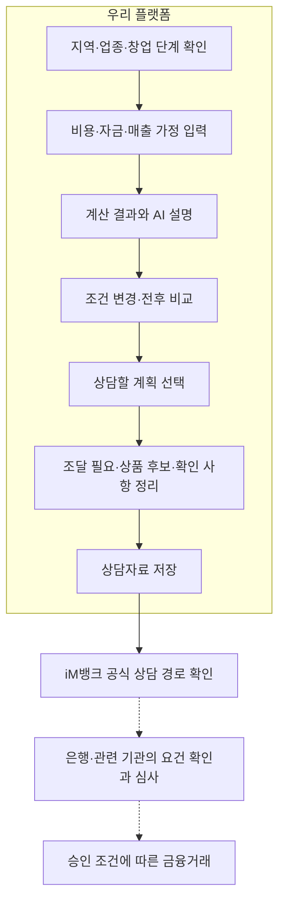

# AI 창업자금 사전상담 → iM뱅크 연결 전환 계획 — Implementation Plan

> **For agentic workers:** 구현 시 `superpowers:executing-plans`를 적용해 아래 체크박스를 작업 단위로 실행한다. 병렬 에이전트 실행은 별도 선택 사항이다. 이 문서 작성은 구현 착수·완료를 뜻하지 않는다.

**Goal:** 플랫폼 안에서 창업자금 계획을 점검·조정하고, 선택한 계획의 자금 수요·상품 후보·확인 사항을 정리해 iM뱅크 공식 상담 경로로 연결한다.

**Architecture:** 기존 Next.js 화면, FastAPI 재무 엔진, 상품 JSON, RAG·SSE 리포트를 재사용한다. `/simulate`를 사전상담과 조건 비교의 중심으로, `/analysis`를 선택한 계획의 상담자료 화면으로 바꾼다. 계산은 서버에서 수행하고, AI는 입력 보완·결과 해석·상담 질문 작성을 담당한다.

**Tech Stack:** Next.js 16.3.2 · React 19.2.8 · TypeScript · TanStack Query · FastAPI · Python · Gemini · PostgreSQL/pgvector · pytest · Vitest · Playwright.

**Spec:** [문제 정의](problem.md) 및 2026-09-18 사용자와 합의한 방향: **① 창업 금융상담 준비를 플랫폼 안에서 진행하고, ② 필요한 금융상품 상담·신청은 iM뱅크에 연결한다.** 기존 문제 정의와 다른 부분은 이 문서의 변경안을 기준으로 후속 문서에 반영한다.

**작성 기준:** 2026-09-18 코드 읽기 및 재무 엔진 설명용 사례 실행. 서비스 전체 테스트·배포·은행 제휴 검증은 이번 문서 작성에서 수행하지 않았다. 기존 미커밋 문서와 코드는 변경하지 않았다.

**추가 확보 항목:** API 키·기존 인증의 점검·상품 및 상담 데이터 확보 계획은 **§10**에 정리했다. 키 값과 실제 환경파일은 열람하지 않았으며, 기존 운영 기록과 코드 연결 상태를 기준으로 분류했다.

## 0. 범위와 공통 제약

- 첫 사용자는 대구에서 업종과 후보 점포를 정하고 계약을 검토하는 예비창업자다. 기존 사업자 운영 개선까지 이번 범위를 넓히지 않는다.
- 은행 연계의 현재 상태는 **제휴 없음·공개된 공식 채널 안내**다. 사용자에게 자료를 저장·지참하게 하며, 은행 전송·예약 접수·신청 완료를 구현된 것처럼 표현하지 않는다.
- 자기자본·미확보 희망대출·초기 투자비·운영준비금을 구분한다. 상품 후보는 자격 확정이나 승인 결과가 아니다.
- 창업 계획의 선택은 **은행에서 상담할 안의 선택**이다. 계약·창업을 실행한다는 확정이 아니다. 계획 축소·보완·보류도 유효한 결과로 둔다.
- 기존 API·계산식을 무단으로 바꾸지 않는다. 아래 추가 계약은 팀 검토 대상으로 명시하고, 요청·응답·매퍼·mock·테스트를 함께 맞춘다.
- [이어받기 §0-6](handoff.md)의 공동 파일 규칙을 따른다: `frontend/src/shared/api/types.ts`와 `backend/main.py`는 **추가만**, 기존 줄 수정 금지. 새 타입은 확장 타입으로 추가한다. 기존 라우터를 활용해 `main.py` 변경을 피한다.
- [백엔드 규칙](../backend/AGENTS.md), [프론트엔드 규칙](../frontend/AGENTS.md)을 적용한다. 새 DB 테이블·로그인·은행 API·채팅 전용 서버를 이번 전환에 추가하지 않는다.
  - > **정정(2026-09-18):** 이 줄의 **DB 테이블 항목만** 같은 날 사용자 결정으로 덮였다. 신규 10테이블(금융상품 4·외부 데이터셋·지표 2·상담 4)이 alembic 리비전 `b93358fab70e`로 추가되어 총 29테이블이 됐다. 근거·설계는 [스키마 마이그레이션 설계](superpowers/specs/2026-09-18-schema-migration-design.md), 실제 스키마는 [ERD](erd.md)를 본다. **로그인·은행 API·채팅 전용 서버는 여전히 추가하지 않는다.** 또한 테이블이 생겼다는 것이 데이터 확보·프론트 연결을 뜻하지 않는다 — 프론트엔드는 여전히 `sessionStorage`이며(§5-3 유지), 센터 데이터는 미확보다(ERD §7).
- 로컬 서버는 백엔드 **8300**, 프론트엔드 **3300**. UI 검증은 기존 Playwright 스크립트를 확장해 **headless: true**로 순차 실행한다. 서버 시작으로 브라우저를 열지 않는다.
- 기존 팀 분담과 **09-19 18:00 코드 프리즈**를 변경하지 않는다. 아래 작업은 우선순위·의존성 제안이며 소요시간이나 마감 내 완료를 보장하지 않는다.

## 1. 바뀌는 프로젝트 정의

> **localhostdaegu는 대구 예비창업자가 AI 사전상담으로 창업자금 계획을 세우고 조정한 뒤, 필요한 금융상품과 확인할 사항을 정리해 iM뱅크 상담으로 이어가도록 돕는 플랫폼이다.**

| 관점 | 제공할 가치 | 검증할 내용 |
|---|---|---|
| 창업자 | 비용·매출 가정을 이해하고, 수정한 계획으로 은행에 무엇을 물어볼지 알게 됨 | 조건 변경의 이유·자금 필요·상담 질문을 설명할 수 있는가 |
| iM뱅크 | 창업 계획과 금융 수요가 구체화된 고객을 만날 접점 | 자료가 상담에 유용한가, 실제 상담과 금융거래로 이어지는가 |
| 플랫폼 | 사전상담부터 공식 상담 경로 안내까지 하나의 경험 제공 | 입력·계산·상품 설명·상담자료가 같은 선택안을 사용하는가 |

은행에 제시하는 고객 유입·상담 효율·거래 전환은 사업 가설이다. 공개 채널 클릭을 실제 상담 완료나 대출 실행으로 집계하지 않는다.

### 목표 동선



지도는 지역 선택과 근거 확인에 사용한다. 지역·업종이 정해진 사용자는 상담 입력으로 진행하고, 미정인 사용자는 기존 지도에서 선택한 뒤 합류한다. 문장 해석 결과의 `district`는 구·군 코드이므로 분석에 필요한 행정동 `region`으로 그대로 사용하지 않는다.

## 2. 현재 구현에서 재사용할 부분

| 자산 | 확인한 구현 | 재사용 방식 |
|---|---|---|
| 재무 계산 | `backend/apps/finance/domain/engine.py` | 초기 투자·고정비·손익분기 매출·시나리오·금리 스트레스 계산 유지. 자금 구성 응답 추가 |
| 입력폼·금액 처리 | `frontend/src/features/simulator/components/simulator-form.tsx`, `lib/money.ts` | 기존 원 단위 계산·금액 입력을 질문형 단계폼에 활용 |
| 금리 초기값 | `features/simulator/hooks/use-latest-loan-rate.ts`, `lib/form-defaults.ts` | 조회 금리와 대체값을 구분해 사용. 개인 적용금리로 설명하지 않음 |
| 지역·업종 해석 | `features/intent-gate/`, `backend/apps/intent/` | 자연어에서 얻은 지역·업종·예산을 상담 초깃값으로 활용. ‘예산’이 자기자본인지 확인 |
| 지도·인허가 지표 | `features/map-explorer/`, `backend/apps/metric/`, `backend/apps/master/` | 지역 선택과 개폐업 현황 근거 화면 유지 |
| 상품 자료·로더 | `data/manual/*.json`, `manual_product_gateway.py` | 운영 자료 12건을 재검토하고 상담 경로 메타데이터 추가 |
| RAG 자료 검색 | `backend/apps/analysis/adapter/outbound/gateways/evidence_search_gateway.py` | 확인할 지원정보와 근거 검색에 활용. 검색 결과만으로 자격·취급 여부를 확정하지 않음 |
| AI·SSE 처리 | `backend/apps/analysis/`, `features/agent-report/` | 요청 저장·스트림·오류 처리·마크다운 렌더링 재사용. 입력과 섹션 내용 변경 |
| 테스트 기반 | `backend/tests/test_finance_*`, `test_analysis_*`, `test_matching.py`, 프론트 컴포넌트 테스트·`tests/*.cjs` | 새 금융 동선의 회귀 사례를 추가하고 기존 동작 확인 |
| 배포·수집 기반 | 기존 FastAPI·Next.js·DB·수집 작업 | 현재 구조 유지. 기능 전환과 무관한 인프라 교체를 하지 않음 |

운영 로더가 읽는 파일은 **`data/manual/`**다. `docs/research/finance-products/`는 조사 기록이므로 그곳만 수정해서 서비스에 반영됐다고 판단하지 않는다.

## 3. 제거·수정·추가할 부분

### 3-1. 주 동선에서 제거하거나 대체할 동작

| 현재 동작·표현 | 조치 | 관련 파일 |
|---|---|---|
| 지도에서 재무 입력 없이 ‘AI 분석’으로 바로 진행 | 주 버튼을 사전상담 입력으로 변경. 지역 분석 단독 기능이 남아도 금융상담 준비 완료로 처리하지 않음 | `features/map-explorer/components/side-panel.tsx` |
| 재무 입력 없을 때 0원으로 상품 매칭 | 계산·상품 안내를 건너뛰고 필요한 입력을 표시 | `backend/apps/analysis/app/use_cases/analysis_agents.py`, `domain/analysis_context.py` |
| 부족액 0원 → ‘자기자본으로 충분해요’ | 자기자본 외 조달 필요와 미확보 희망대출을 함께 표시 | `features/simulator/components/result-view.tsx` |
| ‘부족한 돈, 이렇게 메울 수 있어요’ | 가정에 따른 조달 필요와 상담 후보·조건으로 변경 | 같은 파일, `matching-cards.tsx` |
| 리포트 첫머리의 위험점수·진입 양호/주의 판정 | 선택한 계획·변경 결과·자금 수요를 앞에 배치 | `backend/apps/analysis/domain/report_text.py` |
| 관련 뉴스 검색을 ‘충격 분석’으로 설명 | 보조 근거에 ‘관련 뉴스’로 표시. 계산한 금리 민감도와 구분 | `analysis_agents.py`, `report_sections.py`, `progress-panel.tsx` |
| 내부 에이전트·도구명이 진행 단계의 중심 | ‘입력 확인·지역 근거·자금 계산·상담자료 정리’로 변경 | `features/agent-report/components/progress-panel.tsx` |
| 매칭 없음 → ‘조건을 바꿔보세요’만 표시 | 상품 조건 미확인과 데이터 범위를 설명하고 일반 상담 질문·공식 경로 제공 | `matching-cards.tsx` |

**이번 계획에서 즉시 통째로 삭제할 모듈·DB·수집 자료는 없다.** 위험점수 API와 관련 자료는 주 금융 동선에서 사용을 줄이되, 별도 소비처를 확인하기 전 삭제하지 않는다. 위 동작을 교체하면서 사용되지 않게 된 import·분기·문구·해당 테스트만 함께 정리한다. 기존과 무관한 미사용 코드 정리는 범위에 넣지 않는다.

### 3-2. 기존 기능 수정

| 대상 | 수정 내용 | 완료 조건 |
|---|---|---|
| 홈·진입 | 핵심 행동을 ‘창업자금 사전상담 시작’으로 변경 | 후보 지역·업종·예산이 상담 입력으로 연결됨 |
| 초기값 | 입력 안 함·명시적 0원·가정값을 구분 | 미입력 비용이 0원으로 확정된 계획이 되지 않음 |
| 재무 결과 | 총 준비자금·운영준비금·외부 조달 필요·희망대출·잔여 부족액 표시 | 희망대출 포함 부족액 0원 사례에서도 수요가 보임 |
| 조건 변경 | 최초 계산안과 현재 계산안을 보관하고 비교 | 숫자 수정 후 미계산 값이 리포트에 전달되지 않음 |
| 상품 매칭 | 창업 단계·선행 조건·iM뱅크 연결 근거 반영 | 은행 취급이 확인되지 않은 상품을 iM뱅크 상품처럼 안내하지 않음 |
| 리포트 | 선택안·변경 전후·계산 가정·상품 검토 이유·상담 질문 중심 | 화면과 리포트가 같은 입력으로 계산한 값을 사용 |
| 지역 지표 | 기간·출처·범위를 유지하며 근거로 배치 | 인구·폐업률을 개인 매출 예측·실패 확률로 설명하지 않음 |
| 문서·시연 | 서비스 정의와 완료 기준 통일 | 기획서·신청서·시연이 실제 구현 범위를 설명 |

### 3-3. 추가할 최소 기능

| 추가 기능 | 이번 구현안 | 후속으로 둘 기능 |
|---|---|---|
| 상담 정보 | 사업자등록 여부, 업력(해당 시), 개업 예정일, 자금 필요일, 연령(선택), 보증·정책자금 확인서 진행 상태 | 신용조회·서류 자동 수집 |
| 입력 보완 | 질문형 단계폼과 미확인 항목 목록. 금액은 사용자가 확인한 뒤 계산 | 자유대화만으로 모든 입력 자동 확정 |
| AI 사전 설명 | 첫 계산 뒤 ‘AI와 계획 점검’ 실행. 결과·추가 질문을 보고 조건 수정 | 숫자 입력마다 자동 호출하는 상시 대화 |
| 계획 비교 | 최초안·현재안 2개 및 선택안·변경 이유 | 무제한 안 관리·로그인 기반 장기 보관 |
| 상품 설명 | 연결 근거·미확인 요건·선행 절차·공식 URL·확인일 | 시설/운전자금 자동 배분·복수 상품 조합 최적화 |
| 상담자료 저장 | 구조화 요약과 AI 설명 다운로드, 인쇄용 화면 | 전용 PDF 생성 서버·전자서명 |
| 은행 연결 | 공식 상품·상담 안내 링크 | 은행 전송·상담 예약·대출 신청 API |

인구 카드, 월세 자동 입력, 기존 사업자 유지·전환, 승계, 블록체인 앵커링은 별도 후속 항목으로 유지한다. 금리 스트레스 화면은 보조 기능이며 핵심 흐름보다 뒤에 둔다.

## 4. 반드시 정리할 계산·상담 규칙

### 4-1. 두 자금 수치를 분리한다

현재 `funding_gap`의 산식은 보존하고 라벨을 **‘희망대출 반영 후 남는 부족액’**으로 명확히 한다. 다음 응답을 추가한다.

```python
reserve_months = 6
operating_reserve = monthly_fixed * reserve_months
total_required_funds = capex + operating_reserve
external_funding_need = max(0, total_required_funds - equity)
funding_gap = max(0, total_required_funds - equity - desired_loan)
```

`monthly_fixed`에는 해당 시나리오의 희망대출 이자가 포함된다. 따라서 `external_funding_need`는 그 가정에서의 **자기자본 외 조달 필요액**이며 최소 필요 대출을 최적화한 결과가 아니다. 희망대출·금리를 바꾸면 준비금과 손익도 다시 계산한다.

| 상황 | 표시·연결 규칙 |
|---|---|
| 재무 입력 없음 | 계산값 없음. 0원으로 대체하거나 개인별 상품 안내를 실행하지 않음 |
| 외부 조달 필요 > 0, 희망대출 = 0 | 조달 필요의 규모·용도·시점을 상담 주제로 제시 |
| 잔여 부족액 = 0, 희망대출 > 0 | 미확보 희망대출과 가정에 따른 자금 구성을 표시하고 금융상담 경로 유지 |
| 외부 조달 필요 = 0, 희망대출 = 0 | 계산상 추가 조달 필요 없음. 대출 후보를 강제하지 않고 계획 저장·선택적 상담 안내 |
| 희망대출이 외부 조달 필요보다 큼 | 두 금액과 이자 부담을 함께 표시. 희망대출 전체를 필요한 대출액으로 확정하지 않음 |

### 4-2. 예비창업과 신청 요건을 구분한다

- `business_age_months=0`만으로 사업자등록 전과 등록 직후를 구분할 수 없다. `business_registered`를 별도 입력으로 둔다.
- 모르는 값은 `null` 또는 `unknown`으로 보존한다. 연령 미입력을 자격 충족·미충족으로 단정하지 않는다.
- 보증금·권리금·인테리어·설비·운영준비금은 계산상 비용 구분이다. 상품이 인정하는 시설·운전자금 용도로 자동 매핑하지 않는다.
- 상품 한도가 조달 필요보다 작아도 일부 검토 대상이 될 수 있다. 새 상담 경로에서는 한도 부족을 설명하며, 여러 한도의 단순 합산으로 자금 확보를 보장하지 않는다.
- iM뱅크 공식 [소상공인 정책자금 안내](https://www.imbank.co.kr/cms/fnm/loan/product/giup/01/sda_41216/1221451_5612.html)는 소진공 추천·확인서 및 필요시 보증기관 절차 후 은행 상담·심사를 안내한다. 이처럼 상품별 실제 절차를 카드에 보존한다. 게시된 상품의 현재 접수 가능 여부도 별도 확인 대상이다.
- 확인된 후보가 없어도 상담자료를 만들 수 있다. ‘현재 창업 단계에서 상담 가능한 자금과 신청 시점’을 질문으로 남기고 공식 일반 상담 경로를 제공한다.

## 5. 구현에 사용할 계약안

아래 명칭을 FE·BE·mock에서 일치시킨다. **추가 필드 제안**이며 기존 코드에 이미 존재한다는 뜻이 아니다. 날짜는 `YYYY-MM-DD`, 금액은 원 단위 정수, 비율은 기존 `FinanceInput` 단위를 유지한다.

### 5-1. 재무 응답과 상담 정보

`frontend/src/shared/api/types.ts` 끝에 아래 확장 타입을 추가하고 새 동선에서 사용한다. 기존 `FinanceInput`, `FinanceOutput`, `MatchingProduct`, SSE 이벤트 타입 정의는 보존한다.

```typescript
export interface ConsultationFinanceOutput extends FinanceOutput {
  reserve_months: number;
  operating_reserve: number;
  total_required_funds: number;
  external_funding_need: number;
}

export type PreparationStatus = "not_started" | "in_progress" | "issued" | "unknown";

export interface ConsultationProfile {
  business_registered: boolean | null;
  business_age_months: number | null;
  planned_opening_date: string | null;
  funds_needed_by: string | null;
  owner_age: number | null;
  guarantee_status: PreparationStatus;
  policy_confirmation_status: PreparationStatus;
}

export interface ConsultationContext {
  profile: ConsultationProfile;
  baseline_finance: FinanceInput | null;
  change_reason: string;
  assumptions: string[];
  open_questions: string[];
}

export interface ConsultationAnalysisRequest {
  region: string;
  industry: string;
  question?: string;
  finance: FinanceInput;
  purpose: "review" | "handoff";
  consultation: ConsultationContext;
}
```

`POST /analysis`는 기존 경로와의 호환성을 위해 `purpose` 생략 시 `review`, `consultation` 생략 시 `null`로 처리한다. `handoff`에서는 `finance`와 `consultation`이 필수이며 누락 시 422를 반환한다. `review`도 재무정보가 없으면 자금 계산과 개인별 후보 안내를 수행하지 않는다.

선택안은 기존 `finance`에 담는다. `baseline_finance`는 비교 원본이며 선택안과 함께 백엔드 엔진에서 재계산한다. 클라이언트가 보낸 계산 결과를 리포트의 기준으로 삼지 않는다. 사업자등록 전이면 업력은 0으로, 등록 여부·업력이 불명확하면 미확인으로 유지한다. 입력이 서로 모순되면 먼저 확인한다.

`assumptions`에는 선택안의 사용자 가정·금리와 기본값의 출처·기준시점을, `open_questions`에는 아직 확인하지 못한 비용·일정·요건을 담는다. 단계폼에서 ‘모름’을 선택한 사실이 숫자 가정으로 바뀌면서 사라지지 않게 한다. 이 설명은 계산식을 덮어쓰지 않으며, 서버의 6개월 준비금·시나리오 가정과 구분해 출력한다.

### 5-2. 상품의 상담용 메타데이터

각 운영 JSON에 선택 필드 `consultation_metadata`를 추가한다. 미설정은 미확인으로 처리하고 기존 자료도 계속 읽을 수 있게 한다.

```typescript
export interface ConsultationProductMetadata {
  bank_connection: "direct" | "linked" | "unverified" | "none";
  bank_connection_source_url: string | null;
  business_registration_required: boolean | null;
  prerequisites: string[];
  application_steps: string[];
  documents: string[];
  verified_at: string | null;
}

export interface ConsultationCandidate {
  product: MatchingProduct;
  metadata: ConsultationProductMetadata;
  status: "reviewable" | "prerequisites_needed" | "needs_check";
  reason: string;
  unresolved_conditions: string[];
}
```

- `direct`는 iM뱅크 취급, `linked`는 해당 상품의 iM뱅크 연계 근거가 확인된 경우다. 은행 연결의 분류이며 사용자 자격 판정이 아니다.
- `unverified`·`none`은 iM뱅크 주 상담 후보에서 제외하고, 필요한 경우 관련 기관 참고자료로만 표시한다. 모든 보증·정책자금에 iM뱅크 연결을 자동 부여하지 않는다.
- `reviewable`도 입력으로 확인한 일부 조건에 따라 검토할 수 있다는 뜻이다. 선행 절차·세부 자격·접수 상태는 남은 확인 사항에 표시한다.
- 공신력 있는 근거를 찾지 못한 서류·금리·신청 경로는 생성하지 않는다. 빈 `documents`는 ‘공식 안내에서 준비서류 확인 필요’로 표시한다.

기존 `GET /matching`은 유지하고 같은 라우터에 **`GET /matching/consultation`**을 추가한다. 입력은 `external_funding_need`, `category`, 선택값 `business_registered`, `business_age_months`, `owner_age`이며 응답은 `ConsultationCandidate[]`다. 미상 값은 쿼리에서 생략한다. 소진공·보증 진행 상태는 리포트 질문에 반영하고, 이 최소 매처에서는 확인서 진위를 판정하지 않는다.

순수 함수 `build_consultation_candidates(products, *, external_funding_need, category, business_registered, business_age_months, owner_age)`를 `backend/apps/matching/domain/consultation.py`에 둔다. 새 API와 리포트 게이트웨이가 이 함수를 함께 호출한다. 새 함수는 기존 업종·업력·연령 조건을 이용하되 불명확한 조건은 미확인으로 남긴다. `category=[]`로 제외된 지역 한정 상품은 계속 제외한다. 한도는 설명에 반영하고 자금 부족액 전체를 충당해야 한다는 필터는 적용하지 않는다.

### 5-3. 입력·계획 보관

- 기존 `/simulate`와 `/analysis`를 유지한다. 새 페이지 체계·계정 시스템은 만들지 않는다.
- 한 탭의 한 계획을 `sessionStorage`의 `localhostdaegu.consultation.v1`에 보관한다. 버전, 지역·업종, 입력 초안, 확인한 필드, 최초 계산안, 현재 계산안, 선택안, 상담 정보를 저장한다.
- 입력 초안은 숫자가 확정되기 전까지 빈 값과 0을 구별한다. `FinanceInput`의 13필드는 사용자가 입력·확인한 뒤 요청으로 만든다. ‘모름’은 확인 목록에 남기고, 계산에는 사용자가 선택한 가정값을 명시한다.
- 금리·원가율·수수료율의 기본값과 출처도 확인 대상으로 표시한다. 수정한 입력을 늦게 도착한 금리 조회값이 덮어쓰지 않도록 한다.
- 최초안은 첫 성공 계산으로 고정한다. 새 계산은 현재안을 갱신한다. 둘 중 한 안을 선택해 상담자료에 전달한다.
- 입력 수정 후 재계산 전에는 이전 결과가 이전 입력에 대한 것임을 표시하고 새 선택을 막는다. 계산 중복 요청의 오래된 응답도 최신 결과를 덮어쓰지 않게 한다.
- 지역·업종을 변경하면 비교 대상이 바뀌므로 이전 결과·선택을 무효화한다. 숫자 초안은 재확인 후 사용할 수 있다.
- `/analysis`에서는 저장된 선택안으로 POST한다. 새 경로에서 전체 재무·상담정보를 URL에 추가하지 않는다. 기존 `finance` 파라미터는 이전 링크의 입력 복원에만 사용하고, 값이 없거나 손상되면 상담 입력으로 안내한다.
- sessionStorage가 지워졌거나 다른 탭에서 직접 접속하면 다시 입력하도록 안내한다. 장기 저장 기능으로 설명하지 않는다.

계산안의 저장 형태는 `baseline`과 `current` 각각 `{ input: FinanceInput, result: ConsultationFinanceOutput } | null`로 정한다. `selected`는 `"baseline" | "current" | null`이며, `selected`가 가리키는 계산안이 없으면 최종자료 생성을 막는다. 저장값은 복원할 때 구조·금액·비율을 검증하고 리포트 생성 시 다시 계산한다.

## 6. 작업 순서와 파일별 실행 계획

의존성: **T0 → T1 → T2 → T3 → T4 → T5 → T6**. 구현은 기능별 검증 후 다음 작업으로 이동한다. T3의 상품 원문 확인은 앞 작업과 독립적으로 준비할 수 있으나 자동 병렬 실행을 전제하지 않는다.

### T0. 계약과 변경 범위 정리

**산출물:** §5의 금액 의미·필드명·예외 처리를 담당자가 공유하는 계약으로 사용한다.

- [ ] `docs/problem.md`와 이 계획을 함께 읽고, 목표 경험·현재 구현·후속 기능을 구분한다.
- [ ] 기존 ① 기간 일치, ② AI 진행 표시, ③ 자금 점검 작업과 겹치는 파일을 확인한다. 공통 계약 검토는 기존 PM/아키텍트 역할에 연결한다.
- [ ] §10의 API 키·데이터 확보 목록을 확인한다. Gemini 인증 유형과 배포 설정은 T4 전, 상품 조건·은행 연결 근거는 T3에서 확인한다.
- [ ] 새 필드·엔드포인트·SSE 섹션 변경을 해당 기능 작업과 묶어 기록한다. 기존 타입에 직접 수정이 필요한 경우 확장 타입으로 해결할 수 있는지 먼저 검토한다.
- [ ] 7절 사례를 구현 완료 기준으로 사용한다. 계획 작성만으로 체크하지 않는다.

### T1. 자금 구성 응답 추가와 잘못된 0원 처리 제거

**수정:**

- `backend/apps/finance/domain/engine.py`
- `backend/apps/finance/adapter/inbound/api/schemas/finance_schema.py`
- `backend/apps/analysis/domain/analysis_context.py`
- `backend/apps/analysis/adapter/outbound/gateways/finance_gateways.py`
- `backend/apps/analysis/app/use_cases/analysis_agents.py`
- `frontend/src/shared/api/types.ts` — 확장 타입 추가만
- `frontend/src/app/api/mock/finance/simulate/route.ts`, `frontend/src/app/api/mock/fixtures.ts`

**검증:** `backend/tests/test_finance_engine.py`, `test_finance_router.py`, `test_analysis_agents.py`, `test_analysis_gateways.py`.

**계약:** 기존 `funding_gap` 의미 유지, §5-1 추가 응답 생산. `SimulationSummary`와 게이트웨이 매핑에 추가 금액을 빠짐없이 전달한다.

- [ ] 7절 세 사례의 계산 결과와 재무 누락 시 매처 미호출 회귀 테스트를 먼저 추가해 실패를 확인한다.
- [ ] §4-1 계산식을 엔진 결과·API 응답·분석 요약에 추가한다. 누락 재무를 0으로 간주해 후보를 구하는 분기를 제거한다.
- [ ] 금융 요청 검증(음수·비율 합 1 이상)과 기존 계산 결과가 유지되는지 확인한다.
- [ ] 관련 테스트와 mock 계약을 맞추고 기능 단위로 커밋한다.

대표 테스트 예시(`test_finance_engine.py`의 기존 `BASE` 사용):

```python
from dataclasses import replace

def test_unsecured_loan_remains_visible_when_gap_is_zero():
    inp = replace(BASE, deposit=20_000_000, key_money=0,
                  interior_cost=20_000_000, equipment_cost=10_000_000,
                  monthly_rent=1_000_000, monthly_payroll=900_000,
                  monthly_insurance=100_000, cost_ratio=0.57, fee_ratio=0.03,
                  equity=40_000_000, desired_loan=25_000_000, loan_rate=0.048)
    result = simulate(inp)
    assert (result.total_required_funds, result.external_funding_need,
            result.funding_gap) == (62_600_000, 22_600_000, 0)
```

실행 위치 `backend/`:

```bash
.venv/bin/python -m pytest tests/test_finance_engine.py tests/test_finance_router.py tests/test_analysis_agents.py tests/test_analysis_gateways.py -q
```

### T2. 사전상담 입력·전후 비교·선택안 유지

**수정:**

- `frontend/src/features/intent-gate/components/chat-landing.tsx`, `lib/intent-url.ts`
- `frontend/src/features/map-explorer/components/side-panel.tsx`
- `frontend/src/features/simulator/components/simulator-page.tsx`, `simulator-form.tsx`, `result-view.tsx`
- `frontend/src/features/simulator/lib/form-defaults.ts`, `frontend/src/features/simulator/api.ts`

**추가:**

- `frontend/src/features/simulator/lib/consultation-draft.ts` — 세션 저장·복원·선택안 검증
- `frontend/src/features/simulator/components/consultation-profile-form.tsx` — 창업 단계·시점 입력
- `frontend/src/features/simulator/components/plan-comparison.tsx` — 최초안·현재안 비교와 선택

**검증:** 기존 `simulator-page.test.tsx`, `result-view.test.tsx`, `form-defaults.test.ts`, `intent-url.test.ts`, `side-panel.test.tsx`를 확장한다. 새 상태 규칙은 `consultation-draft.test.ts`에 검증한다.

**계약:** §5-3의 보관 규칙을 구현한다. 선택안의 `FinanceInput`과 `ConsultationContext`를 T4·T5에서 사용한다.

- [ ] 최초안 월세 200만 원 → 현재안 100만 원 → 최초안 재선택의 입력·결과 유지 테스트를 먼저 작성한다.
- [ ] 단계폼을 ‘창업 단계 → 비용·자금 → 매출 가정 → 계산·비교’로 구성하고 기존 금액 컴포넌트를 재사용한다.
- [ ] 유효한 0원과 미입력을 구분한다. 단순히 모든 비용이 양수여야 한다는 검증은 넣지 않는다.
- [ ] 결과의 주 지표를 손익분기 매출·준비자금·조달 필요로 바꾸고 ‘이 안으로 상담 준비’를 제공한다.
- [ ] 주 지도 버튼을 입력으로 연결한다. 홈 문장에 지역·업종 정보가 부족하면 선택을 보완한다. 기존 intent의 구·군 코드를 행정동 코드로 오용하지 않는다.
- [ ] 재계산 실패·오래된 응답·지역 변경·새로고침·빈 세션에서 선택안이 잘못 이어지지 않는지 확인하고 커밋한다.

검증에서 사용할 기대값:

```typescript
// 각각 실제 사용자의 입력·계산·선택 동작 뒤 상태를 검증한다.
const stored = sessionStorage.getItem("localhostdaegu.consultation.v1");
expect(stored).not.toBeNull();
const draft = JSON.parse(stored!);
expect(draft.selected).toBe("current");
const selected = draft.current;
expect(selected.input.monthly_rent).toBe(1_000_000);
expect(selected.result.bep_revenue).toBe(5_000_000);
expect(selected.result.external_funding_need).toBe(2_000_000);
```

실행 위치 `frontend/`:

```bash
npx vitest run src/features/simulator src/features/intent-gate src/features/map-explorer/components/side-panel.test.tsx
npx tsc --noEmit
```

### T3. iM뱅크 상담 후보와 선행 절차

**수정:**

- `data/manual/imbank_products.json`, `data/manual/dgsinbo_products.json`, `data/manual/daegu_youth_startup.json`
- `docs/research/finance-products/2026-09-17-finance-products.md` — 추가 확인의 날짜·출처 기록
- `backend/apps/matching/adapter/outbound/gateways/manual_product_gateway.py`
- `backend/apps/matching/adapter/inbound/api/v1/matching_router.py`
- `frontend/src/features/simulator/api.ts`, `components/matching-cards.tsx`

**추가:**

- `backend/apps/matching/domain/consultation.py` — §5-2의 순수 후보 구성 함수
- `backend/apps/matching/adapter/inbound/api/schemas/consultation_schema.py` 및 필요한 패키지 `__init__.py` — 새 응답 DTO
- `frontend/src/app/api/mock/matching/consultation/route.ts`
- `backend/tests/test_matching_consultation.py`
- `docs/research/finance-products/2026-09-18-consultation-sources.md` — §10-3의 상품별 원문·확인 결과 기록

**계약:** `GET /matching/consultation` 및 §5-2 `ConsultationCandidate[]`. 기존 `/matching`과 `match_products`의 소비처는 유지한다.

- [ ] 운영 상품 12건의 공식 원문에서 취급·연계, 등록·업력, 선행 절차, 준비자료, 최신 접수 안내를 확인한다. 확인할 수 없는 항목은 미확인으로 기록한다.
- [ ] iM뱅크 취급 근거 없음, 등록 전, 업력 부족, 연령 불명, 한도 일부 부족, 후보 없음 사례의 테스트를 먼저 작성한다.
- [ ] 새 함수를 구현하고 같은 라우터에 엔드포인트를 추가한다. 등록 여부·금액·업력·연령 쿼리는 범위를 검증한다.
- [ ] 새 카드에 후보의 이유·미확인 조건·신청 절차·공식 링크를 표시한다. 지역 한정 상품 제외를 유지한다.
- [ ] 자료 캐시를 테스트에서는 `load_all_products.cache_clear()`로 초기화하고, 운영 반영 시 서버 재시작 필요를 기록한다.
- [ ] 후보가 없을 때에도 일반 상담 질문·공식 안내가 남는지 확인하고 커밋한다.

대표 도메인 테스트(합성 데이터임을 명확히 표시):

```python
from apps.matching.domain.consultation import build_consultation_candidates

def test_unverified_bank_connection_is_not_a_bank_candidate():
    product = {
        "product_id": "test-only", "provider": "테스트 기관",
        "provider_type": "guarantee", "product_name": "합성 테스트 상품",
        "target": "테스트", "region": "대구", "category": None,
        "business_age_min": 0, "business_age_max": None, "owner_age_max": None,
        "loan_limit": 10_000_000, "interest_rate": None, "guarantee_fee": None,
        "url": "https://example.org", "source_url": "https://example.org",
        "consultation_metadata": {
            "bank_connection": "unverified", "bank_connection_source_url": None,
            "business_registration_required": None, "prerequisites": [],
            "application_steps": [], "documents": [], "verified_at": None,
        },
    }
    assert build_consultation_candidates(
        [product], external_funding_need=2_000_000, category="cafe",
        business_registered=False, business_age_months=0, owner_age=None,
    ) == []
```

실행 위치 `backend/`:

```bash
.venv/bin/python -m pytest tests/test_matching.py tests/test_matching_consultation.py -q
```

실행 위치 `frontend/`:

```bash
npx vitest run src/features/simulator/components/matching-cards.test.tsx
```

### T4. AI 사전 설명과 상담자료의 입력·내용 연결

**수정:**

- `backend/apps/analysis/adapter/inbound/api/schemas/analysis_schema.py`
- `backend/apps/analysis/adapter/inbound/mappers/analysis_mapper.py`
- `backend/apps/analysis/domain/analysis_context.py`, `domain/report_text.py`
- `backend/apps/analysis/app/ports/output/analysis_port.py`
- `backend/apps/analysis/adapter/outbound/gateways/finance_gateways.py`
- `backend/apps/analysis/app/use_cases/analysis_agents.py`, `report_sections.py`
- `frontend/src/features/agent-report/hooks/use-agent-report.ts`
- `frontend/src/features/agent-report/components/progress-panel.tsx`, `report-view.tsx`
- `frontend/src/features/simulator/components/simulator-page.tsx`
- `frontend/src/app/api/mock/analysis/route.ts`, `analysis/[id]/events/route.ts`

**검증:** `backend/tests/test_analysis_*.py`, `backend/tests/analysis_fakes.py`, `use-agent-report.test.ts`, `progress-panel.test.tsx`를 갱신한다.

**계약:** §5-1의 분석 요청을 schema → mapper → domain → gateway까지 전달한다. 기존 SSE 이벤트 종류는 유지한다. `ProductMatchingPort.match`에 `profile: ConsultationProfile | None = None`을 추가하고 첫 금액 인자의 의미를 `external_funding_need`로 통일한다. Python의 `ConsultationProfile`은 `analysis_context.py`에 §5-1과 같은 필드의 프레임워크 없는 dataclass로 정의한다. 게이트웨이는 T3의 순수 함수를 호출하고, `MatchedProduct`에 상품 ID·URL·확인일·연계 근거·절차·미확인 조건을 보존하도록 기본값이 있는 필드를 추가한다.

- [ ] `purpose=handoff`인데 재무·상담정보가 없으면 422, 비교안과 선택안을 서버에서 재계산하는 테스트를 추가한다.
- [ ] 기존 `SimulationPort.simulate`로 선택안과 비교안을 계산해 `AnalysisContext`의 `simulation`과 새 `baseline_simulation`에 보관한다.
- [ ] 첫 결과 화면에서 명시적인 ‘AI와 계획 점검’ 버튼으로 `purpose=review`를 요청한다. 금액 입력마다 호출하지 않는다. 사용자의 추가 질문은 기존 `question`을 사용한다.
- [ ] AI 설명을 읽고 같은 화면에서 조건을 수정·재계산할 수 있게 한다. 숫자 조건을 바꾸는 질문은 실제 입력 변경과 재계산으로 연결한다. 모델이 계산하지 않은 가상 결과를 확정값처럼 쓰지 않는다.
- [ ] `handoff`의 섹션 키를 `plan`, `comparison`, `calculator`, `funding`, `questions`, `market`으로 구성한다. 기존 섹션 구현 구조를 재사용하고 프론트 순서·mock·테스트를 동시에 맞춘다.
- [ ] 계획·비교·자금 숫자는 코드로 표를 작성한다. LLM에는 입력·가정·출처·미확인 사항을 전달해 변경 이유와 상담 질문을 쓰게 한다.
- [ ] 뉴스는 필요한 경우 지역 근거의 보조자료에 넣고, 위험점수로 창업 또는 대출 적격 여부를 판정하는 헤드라인을 제거한다.
- [ ] LLM 실패 시 결정론 계산표와 확인 목록은 남기고 설명 실패를 표시한다. 계산 실패나 입력 누락이면 상담자료 완성으로 표시하지 않는다.
- [ ] 관련 테스트를 실행하고 커밋한다.

실행 위치 `backend/`:

```bash
.venv/bin/python -m pytest tests/test_analysis_domain.py tests/test_analysis_agents.py tests/test_analysis_gateways.py tests/test_analysis_report_text.py tests/test_analysis_sections.py tests/test_analysis_router.py tests/test_analysis_interactor.py -q
```

실행 위치 `frontend/`:

```bash
npx vitest run src/features/agent-report src/features/simulator
```

### T5. 상담자료 저장과 공식 경로 안내

**수정:** `frontend/src/features/agent-report/components/analysis-page.tsx`, `analysis-form.tsx`, `report-view.tsx`.

**추가:**

- `frontend/src/features/agent-report/lib/consultation-export.ts` — 완성된 섹션과 출처를 Markdown으로 저장
- `frontend/src/features/agent-report/components/bank-handoff.tsx` — 공식 상담 링크·상담 준비 문구
- `frontend/src/features/agent-report/components/report-print.css` — 요약·근거의 인쇄 스타일
- `frontend/src/features/agent-report/components/bank-handoff.test.tsx`, `lib/consultation-export.test.ts`

**계약:** T2의 선택안과 T4의 최종 `handoff` 리포트를 사용한다. 사용자가 편집 중인 입력·이전 review 결과를 최종자료로 내보내지 않는다.

- [ ] 선택안 변경 후 이전 자료의 다운로드를 막는 테스트와, 내보낸 금액·변경 이유·출처가 화면과 일치하는 테스트를 작성한다.
- [ ] 저장된 선택안을 불러와 사람이 읽는 지역명·업종명·자금요약을 보여준다. 지역 코드를 사용자가 직접 타이핑하는 폼을 주 동선에서 제거한다.
- [ ] 최종자료를 ‘플랫폼 작성 상담 준비자료’로 표시한다. 상단 한 장 분량의 요약에 선택안·자금 수요·주요 질문을 넣고 상세 근거는 뒤에 배치한다.
- [ ] 사용자 클릭으로 Markdown 저장과 인쇄를 제공한다. PDF가 필요하면 브라우저 인쇄의 PDF 저장을 사용한다. PDF 전용 라이브러리를 추가하지 않는다.
- [ ] ‘iM뱅크 공식 상담 안내 확인’과 확인된 상품의 공식 안내를 제공한다. 링크 이동으로 개인정보나 계획을 은행에 전송하지 않는다.
- [ ] 보류·추가 확인 선택에서도 자료 저장과 조건 수정이 가능하게 한다. 은행으로의 이동을 강제하지 않는다.
- [ ] 실링크의 도메인·목적지를 확인하고, 앱 테스트에서는 외부 은행 사이트 조작 없이 링크 존재·주소·문구를 검증한다. 커밋한다.

공식 연결 후보: [iM뱅크 홈페이지](https://www.imbank.co.kr/), [경영컨설팅 상담 안내](https://www.imbank.co.kr/cms/dgi/sdd_6/sdd_63/1193401_3090.html), T3에서 검증한 개별 상품 안내. 금융상품 문의와 경영컨설팅 경로의 목적을 구분한다. 예비창업자 대상 여부·상담 가능 범위는 확인 질문에 포함한다.

실행 위치 `frontend/`:

```bash
npx vitest run src/features/agent-report
npx tsc --noEmit
```

### T6. 전체 여정 검증과 문서·시연 정합성

**수정:**

- `frontend/tests/funnel.cjs`, `frontend/tests/analysis.cjs`
- `docs/problem.md`, `docs/daegunavi.md`, `docs/application_form.md`
- `docs/handoff.md`, `docs/jekyll.md` — 기존 문서 담당의 통합 절차로 반영

**산출물:** 7절 사례의 검증 결과와 제출 설명·시연 대본.

- [ ] `funnel.cjs`를 첫 입력 → 최초 계산 → 조건 수정 → 선택안 확정 → 상담자료 → 공식 링크까지 확장한다.
- [ ] `analysis.cjs`는 새 섹션과 수정된 값·미확보 희망대출·준비자료를 확인하도록 바꾼다. 기존 제목이 보이는지만 검사하는 것으로 완료 처리하지 않는다.
- [ ] mock 성공 후 실제 백엔드로 같은 부족액 경로를 확인한다. LLM의 문장 전체를 고정값으로 검사하지 않고 계산표·필수 질문 영역·출처·오류 표시를 확인한다.
- [ ] 지도 폴리곤 클릭 실패 후 URL 폴백으로 이어진 경우 실제 선택 동선 통과와 구분해 기록한다.
- [ ] 아래 전체 검증을 수행하고, 실패 원인이 환경·기존 결함이면 구현 실패와 구분해 기록한다. 전부 통과한 것처럼 표시하지 않는다.
- [ ] 서비스 정의·흐름·은행 가치·미구현 기능·제휴 상태를 문서와 시연에 맞춘다.
- [ ] 전체 변경을 검토한 뒤 기존 PR·병합 절차를 따른다. 계획 실행만으로 배포·은행 접수·외부 공유를 수행하지 않는다.

전체 확인 명령(각 디렉터리에서 실행):

```bash
# backend/
.venv/bin/python -m pytest tests/ -q
```

```bash
# frontend/
npx vitest run
npx tsc --noEmit
npm run build
```

E2E는 백엔드 8300·프론트엔드 3300 서버가 준비됐고 프론트가 실제 백엔드를 사용하도록 기동됐는지 HTTP로 확인한 뒤, **하나가 종료된 후 다음 명령을 실행**한다. 기존 서버는 종료하지 않는다.

```bash
# 저장소 루트
E2E_REUSE_SERVER=1 E2E_API_BASE=http://localhost:8300 node frontend/tests/funnel.cjs
E2E_REUSE_SERVER=1 E2E_API_BASE=http://localhost:8300 node frontend/tests/analysis.cjs
```

## 7. 수치 예시와 인수 기준

### 7-1. 주 시연: 월세를 바꾸고 금융상담 준비

현재 엔진을 직접 실행해 아래 숫자를 확인했다. 조건 비교·새 응답·은행 연결 기능의 구현 검증은 별도로 수행해야 한다.

| 입력 | 최초안 | 수정안 |
|---|---:|---:|
| 보증금 / 권리금 / 인테리어 / 설비 | 2,000만 / 0 / 2,000만 / 1,000만 원 | 동일 |
| 자기자본 / 희망대출 | 6,000만 / 0원 | 동일 |
| 월세 | 200만 원 | 100만 원 |
| 월 인건비 / 보험료 | 90만 / 10만 원 | 동일 |
| 원가율 / 수수료율 | 57% / 3% | 동일 |
| 예상 월매출 / 연 금리 | 800만 원 / 4.5% | 동일 |

| 계산 | 최초안 | 수정안 |
|---|---:|---:|
| 초기 투자비 | 5,000만 원 | 5,000만 원 |
| 월 고정비 | 300만 원 | 200만 원 |
| 손익분기 월매출 | 750만 원 | 500만 원 |
| 6개월 운영준비금 | 1,800만 원 | 1,200만 원 |
| 총 준비자금 | 6,800만 원 | 6,200만 원 |
| 자기자본 외 조달 필요액 | 800만 원 | 200만 원 |
| 희망대출 반영 후 부족액 | 800만 원 | 200만 원 |

수정안을 선택하면 상담자료의 월세는 100만 원, 조달 필요액은 200만 원이어야 한다. 최초안의 800만 원으로 상품을 조회하거나, 비교표의 최초 조건을 현재 조건처럼 설명하면 실패다. 새 대출액을 입력하면 이자·준비금이 달라지므로 다시 계산한다.

### 7-2. 필수 회귀: 희망대출 때문에 부족액이 0원

수정안에서 자기자본 **4,000만 원**, 희망대출 **2,500만 원**, 연 금리 **4.8%**로 바꾼다.

- 월 이자 10만 원, 월 고정비 210만 원.
- 6개월 운영준비금 1,260만 원, 총 준비자금 **6,260만 원**.
- 자기자본 외 조달 필요액 **2,260만 원**, 희망대출 반영 후 부족액 **0원**.
- 미확보 희망대출 **2,500만 원**과 은행에서 확인할 조건이 계속 보여야 한다. ‘자기자본으로 충분’ 표현은 없어야 한다.

### 7-3. 인수 체크리스트

- [ ] 재무 입력 없이 최종 금융상담 자료를 만들 수 없고, 누락을 0으로 처리하지 않는다.
- [ ] 입력한 0원은 유효하게 유지하며, 미입력·가정값과 구분한다.
- [ ] 최초안·수정안·선택안의 값과 비교 이유가 일치한다.
- [ ] 미제출 입력·오래된 응답·다른 지역의 결과가 선택안에 섞이지 않는다.
- [ ] 저장·복원·리포트 생성 뒤에도 같은 선택안으로 서버에서 계산한다.
- [ ] 부족액 양수·희망대출 포함 0원·자기자본만으로 0원 세 경로를 검증한다.
- [ ] 등록 전·등록 후·업력/연령 불명의 차이를 후보와 확인 사항에 반영한다.
- [ ] 확인된 iM뱅크 후보가 없어도 자료 저장과 공식 일반 상담 안내가 가능하다.
- [ ] 선행 기관 절차를 누락하거나 실제 접수·승인 완료처럼 표시하지 않는다.
- [ ] AI 실패·재무 실패·상품 조회 실패를 구분하고 미완성 자료를 완성으로 표시하지 않는다.
- [ ] 지역 근거는 실제 계산 경로의 기준연도·자료 범위와 일치한다. 기존 기간 일치 작업이 끝나기 전에는 지도 선택 연도가 리포트에 반영됐다고 쓰지 않는다.
- [ ] 인쇄·다운로드 자료에 계산 가정·출처·미확인 사항이 포함된다.

## 8. 문서에 반영할 변경과 팀 연결

| 문서·역할 | 반영할 내용 |
|---|---|
| `problem.md` §1·§4·§5·§12 | AI 사전상담을 플랫폼 안에서 진행하고 iM뱅크 금융상담으로 이어지는 정의·역할·결과물 |
| `problem.md` §6·§8·§9·§10 | 두 자금 수치의 의미, 신규 계약, 구현 상태, 희망대출 포함 0원 사례, 상담 후보 표현 |
| `daegunavi.md` | 위험 진단 중심 동선에서 사전상담·비교·계획 선택 중심으로 전환. 보유 데이터와 실제 사용 기능 구분 |
| `application_form.md` | 대상은 계약 검토 예비창업자, 은행 가치는 상담 유입 가설. 폐업률 감소·실제 신청 가능 등 미검증 단정 수정 |
| `handoff.md`·`jekyll.md` | 실제 완료 작업·검증 결과·남은 계약만 기록. 계획을 구현 완료로 기록하지 않음 |
| 기존 ③ 자금 점검 담당 | T1 재무 계약과 T2 상담 입력·비교 작업 연결 |
| 기존 ①·② 분석 담당 | T4 요청 전달·기간 정보·SSE 표시와 연결 |
| PM/아키텍트 및 관련 담당 | T3 매처·상품 계약, T5 최종 화면 경계, 공통 파일과 범위 조정 협의 |
| 문서·영상 담당 | T6의 실제 완주 결과를 기준으로 대본·영상·신청서 작성 |

이 표는 기존 역할과의 연결점이며 새 업무 배정표가 아니다.

## 9. 범위 축소와 완료 판단

시간이 부족하면 자유채팅, 전용 PDF 생성, 상품 조합 최적화, 금리 스트레스 전용 화면, 계좌·정산 서비스 확장을 먼저 제외한다. **입력 보완 → 계산·비교 → 선택안 유지 → 자금 수요·확인 사항 → 저장·공식 상담 안내**는 하나의 핵심 흐름으로 완성한다.

개별 상품 검증이 부족하면 후보를 억지로 채우지 않고 일반 상담 경로와 질문을 제공한다. 이 경우 제출물도 ‘상품별 연결 완성’이 아니라 ‘자금 수요 기반 상담 안내’로 범위를 명시한다.

완료 기준은 **사용자가 플랫폼에서 조건을 바꾸고 자금 수요를 이해한 뒤, 선택한 계획과 질문을 가지고 iM뱅크 공식 상담 경로로 이동할 수 있는 것**이다. 은행의 실제 자료 수신·상담 완료·금융거래는 이번 제휴 없는 프로토타입의 완료 기준에 포함하지 않는다.

## 10. API 키·추가 데이터 확보 계획

### 10-1. 지금 확보해야 하는 것의 결론

이번 기능 전환만을 위해 **새 제공기관의 API 키를 반드시 추가해야 하는 항목은 현재 없다.** 재무 계산·조건 비교·계획 보관·자료 저장은 자체 코드로 처리하고, 금융상품은 공식 자료를 확인해 수기 JSON으로 관리하며, 은행 연결은 공식 링크 안내로 구현한다.

다만 **기존 Gemini 인증 유형 확인·필요시 교체**, 기존 온통청년 키의 재발급 과제, 운영 도메인·환경 설정 점검은 별도로 남는다. ‘새 서비스 키가 필요 없음’과 ‘기존 키를 그대로 쓸 수 있음’은 구분한다.

이번에 우선 확보할 것은 **① 상품별 iM뱅크 취급·연계 근거, ② 등록 전 신청·상담 가능 범위와 선행 절차, ③ 상담에 필요한 서류·공식 경로·최신 확인 기록, ④ 사용자가 입력할 창업 단계·자금 시점 정보**다.

**상태 표기의 기준:** 아래 ‘보유·사용 기록 있음’은 [이어받기](handoff.md)와 코드에서 확인한 기록이다. 현재 `.env`의 값·유효성·과금 계정·운영 서버 배포 상태는 이번 문서 보완에서 확인하지 않았다. 실제 인증 요청 성공은 구현·배포 검증 때 따로 기록한다.

### 10-2. 기존 키 재사용과 인증 점검

| 우선순위·항목 | 현재 확인한 상태 | 필요한 조치·발급 경로 | 미확보·실패 시 처리 |
|---|---|---|---|
| **P0 `GEMINI_API_KEY`** | 리포트 생성과 RAG 질의 임베딩이 같은 설정을 사용. 이전 실연동 성공 기록 있음. 현재 키 유형은 미확인 | [Google AI Studio](https://aistudio.google.com/api-keys)에서 프로젝트·키 유형·허용 모델·사용 한도를 확인. 유효한 키 재사용, 필요한 경우 교체 | 재무 계산·비교는 가능하지만 AI 사전상담 완성으로 제출하지 않음. LLM과 임베딩 호출을 각각 확인 |
| **P0 지도 사용 시 `NEXT_PUBLIC_VWORLD_KEY` / `VWORLD_API_KEY`** | 프론트 WMTS 배경지도와 백엔드 경계 수집 코드가 존재 | 기존 브이월드 인증키의 사용 범위·등록 URL을 [브이월드 개발자 서비스](https://www.vworld.kr/)에서 확인. `localhost:3300` 및 `localhostdaegu.cloud` 배포 환경에서 지도 요청 검증 | 수집된 행정동·경계로 선택 기능을 구성할 수 있는지 확인. 배경지도 실패를 자금 계산 실패와 구분 |
| **P1 `ECOS_API_KEY`** | 금리 수집에 사용. 프론트는 외부 ECOS가 아니라 백엔드의 적재 금리 조회 API를 호출 | 기존 키로 [한국은행 ECOS Open API](https://ecos.bok.or.kr/api/)의 필요한 통계 갱신을 확인 | 적재 금리는 기준월 표시. 조회값 없을 때 기존 4.5% 가정값과 사용자 수정 입력을 명시 |
| **P1 `BIZINFO_API_KEY`** | 기업마당 공고 수집과 RAG 색인 경로가 존재 | 기존 키·이용 권한으로 [기업마당](https://www.bizinfo.go.kr/) 지원사업 공고 갱신을 확인 | 저장 자료의 신청 기간·종료 여부를 확인하고, 최신 상품 조건은 공식 원문으로 재확인 |
| **P1 `DATA_GO_KR_API_KEY`** | 인허가 등 기존 수집기에 연결. 지역 집계·기존 DB를 읽는 매 요청마다 외부 키가 필요한 것은 아님 | [공공데이터포털](https://www.data.go.kr/)에서 실제 사용하는 개별 API의 활용신청·운영 권한·호출 한도 확인 | 확보된 자료의 기준일·범위를 표시. 갱신 실패와 자료 미존재를 구분 |
| **P1 청년 지원 사용 시 `YOUTHCENTER_API_KEY`** | 수집·사용 기록 있음. `handoff.md`에 키 재발급 권장 과제가 남아 있음 | [온통청년](https://www.youthcenter.go.kr/)에서 기존 재발급 과제 처리 여부 확인. 미처리라면 교체 후 수집 검증 | 청년 지원 추가 안내를 축소하고 검증한 상품·공식 공고만 사용. 핵심 재무 계산은 유지 |
| **후속 `RONE_API_KEY`** | 임대료 자료 적재 기록은 있으나 현재 시뮬레이터 월세 자동 입력으로 연결되지 않음 | 자동 입력 기능을 별도로 채택할 때 [R-ONE](https://www.reb.or.kr/r-one/) 제공 범위·지역 단위·집계 기준 확인 | 이번에는 후보 점포의 월세를 사용자가 입력. 통계 임대료를 개별 점포 계약 월세로 대체하지 않음 |

**Gemini 인증의 조건부 교체:** 2026-09-18 열람한 공식 안내는 2026년 9월 Standard 키 요청 거부와 Auth 키 전환을 안내한다. 따라서 기존 성공 기록만으로 재사용을 확정하지 않는다. AI Studio의 Key Type을 확인하고, Standard 키라면 현재 안내에 따라 새 Auth 키를 발급해 `GEMINI_API_KEY` 설정을 갱신한 뒤 생성·임베딩 모두 검증한다. 이미 유효한 Auth 키라면 중복 발급할 필요는 없다. [Google 공식 키 관리·전환 안내](https://ai.google.dev/gemini-api/docs/api-key)

키 교체만으로 임베딩 모델을 바꾸지 않는다. 현재 코드의 색인·검색 모델은 `gemini-embedding-001`이다. 모델 변경은 기존 벡터와의 호환성 및 재색인 범위를 확인하는 별도 작업이다.

**API 키와 구분할 운영 설정:**

| 설정 | 확인할 내용 |
|---|---|
| `GEMINI_REPORT_MODEL` | API 키가 아닌 생성 모델 선택값. 현재 코드 기본값은 `gemini-3.8-flash`이며 배포 프로젝트에서 실제 호출 가능 여부 확인 |
| `NEXT_PUBLIC_API_BASE` | 프론트 요청 목적지. 미설정 시 코드 기본값은 `/api/mock`이므로 실연동 시 운영 백엔드 주소·프록시 경로 확인 |
| `VWORLD_SERVICE_DOMAIN` | 백엔드 코드 기본값에 원천 프로젝트 도메인 `beyondfacade.cloud`가 남아 있음. 실제 키 등록 조건과 이번 운영 도메인에 맞는지 확인 후 설정 |
| `DATABASE_URL` | 기존 데이터·RAG 조회를 위한 DB 연결 설정. 새 공공 API 키가 아니며 실제 운영·테스트 DB를 구분 |
| 환경변수 우선순위 | 현재 설정 로더는 OS 환경변수 → `backend/.env` → 루트 `.env` 순으로 우선 적용. 교체한 키가 상위 설정에 가려지지 않는지 확인 |

키는 발급자·용도·설정 여부·검증일만 기록한다. 서버용 Gemini·공공데이터 키를 `NEXT_PUBLIC_*`로 옮기지 않는다. `NEXT_PUBLIC_VWORLD_KEY`는 현재 브라우저 지도 호출에 쓰이는 키이므로 해당 서비스의 브라우저 사용 조건에 맞춰 설정한다.

### 10-3. 이번 전환에 추가로 수집·정리할 데이터

| 우선순위·데이터 | 현재 상태 | 확보처·확보 방법 | 최소 확보 항목 | 반영 위치·완료 기준 |
|---|---|---|---|---|
| **P0 상품별 iM뱅크 연결 근거** | 운영 JSON은 iM뱅크 3건·대구신보 5건·정책 4건. 12건 모두 `consultation_metadata` 없음 | iM뱅크·대구신보·소진공 등 공식 상품 설명과 취급기관 안내를 수기 대조 | 직접 취급/연계/미확인/없음, 근거 URL, 확인일 | `data/manual/*.json`의 §5-2 메타데이터. 확인된 근거가 있어야 주 은행 후보에 포함 |
| **P0 창업 단계별 이용 요건** | 기존 `target` 문장·업력 일부 필터만으로 등록 전 상태를 판단하기 어려움 | 상품 원문·사업 공고의 신청 자격과 신청 시점 확인 | 사업자등록 필요 여부, 업력·지역·업종·연령 조건, 확인되지 않은 요건 | 기존 조건 필드와 `business_registration_required`, `prerequisites`. 등록 전 이용 가능 여부를 추정으로 채우지 않음 |
| **P0 선행 절차·준비자료** | 구조화된 `application_steps`, `documents` 미보유 | 공식 신청 안내·상품 설명서·자주 묻는 질문 확인 | 소진공 확인서/보증 등 선행 단계, 은행 방문·온라인 경로, 기본 서류, 추가 확인 항목 | §5-2 메타데이터와 T3 카드·T4 상담 질문. 상품별 순서를 보존 |
| **P0 접수·정보 유효성** | 파일 존재만으로 현재 판매·접수 여부를 확정할 수 없음 | 최신 공식 공고·상품 페이지 확인. 확인 불가 시 ‘기관 확인 필요’ 기록 | 신청 기간, 종료·예산 소진 안내, 원문 게시·변경일, 확인일 | 원문 기록 문서와 후보 설명. 확인일을 접수 가능 보장으로 해석하지 않음 |
| **P0 공식 상담 경로** | 상품 URL과 공식 경영컨설팅 안내는 확인했으나 전용 제휴 창구 없음 | iM뱅크 공식 상품·고객상담·영업점 안내에서 경로 확인 | 상담 목적, 공식 URL, 제공되는 경우 연락처·접수 방법, 예비창업자 대상 여부 | T5 `bank-handoff.tsx`와 원문 기록. 금융상품 문의와 경영컨설팅 구분 |
| **P0 사용자 상담 정보** | 현 입력은 재무 13필드 중심. 등록 여부·시점·진행 상태는 미구현 | 사용자에게 단계폼으로 직접 확인. 외부 API·자동조회 불필요 | §5-1 `ConsultationProfile`, 변경 이유, 가정, 미확인 질문 | 세션 상태와 분석 요청. 모름을 0·아니오로 변환하지 않음 |
| **P0 비용·매출 가정의 근거** | 원가율·수수료율·금리 기본값과 사용자 입력이 혼재 | 견적·계약 검토값은 사용자 확인, 공공 통계 기본값은 출처·기간 확인 | 사용자 입력/추정/기본값 구분, 단위, 기준일, 수정 여부 | `assumptions`, `open_questions` 및 입력 설명. 근거 불명 기본값은 예시 가정으로 명시 |
| **P0 지역 근거의 표시 정보** | 인허가·지역 집계·금리 등이 적재돼 있으나 기간 전달에 남은 작업 있음 | 기존 DB·수집 로그·원천 메타정보를 대조 | 기준 기간·집계 범위·단위·원천·누락 여부 | 기존 기간 일치 작업과 T4 리포트. 새 데이터 구매보다 전달·표시 정합성을 우선 |
| **P1 사용자·은행 상담 피드백** | 서비스 유용성·상담 전환은 미검증 가설 | 사용자 관찰, 추후 은행 담당자·멘토에게 상담자료 검토 요청 | 이해하기 어려운 항목, 추가 필요자료, 다음 행동, 실제 상담 활용 여부 | 평가 기록. 피드백 확보를 API 연동 완료나 은행 공식 채택으로 표현하지 않음 |

상품 원문 확인 결과는 새 조사 문서 `docs/research/finance-products/2026-09-18-consultation-sources.md`에 아래 항목으로 기록한다. **이 조사 문서는 T3에서 작성할 산출물이며 아직 생성하지 않았다.**

| 기록 항목 | 작성 기준 |
|---|---|
| 식별 | `product_id`, 상품명, 제공기관, 공식 출처 URL |
| 시간 | 원문 게시·변경일과 확인일을 구분. 원문에 없으면 미기재로 표시 |
| 은행 연결 | 확인한 취급·연계 근거와 설명. 검색 결과 제목만으로 확정하지 않음 |
| 자격·절차 | 등록·업력·업종 등 요건, 선행 단계, 신청 경로, 준비서류 |
| 금액·용도 | 공시 한도·금리 표현·보증료·자금용도. 개별 승인조건과 구분 |
| 미확인 사항 | 예비창업자 가능 여부, 접수 가능 여부 등 확인하지 못한 내용 |
| 반영 | 운영 JSON의 어느 필드에 반영했는지, 조회·리포트에서 어떻게 표시되는지 |

은행 설명서의 운전자금·시설자금 구분을 확보하더라도 개인의 비용을 각 상품에 자동 배분하는 기능은 이번 범위에 넣지 않는다. 상환 방식·거치기간을 조사 기록에 보관할 수 있지만 원금 상환 모델을 구현하지 않은 상태에서 상환능력을 계산했다고 설명하지 않는다.

### 10-4. 후속 기능을 채택할 때만 검토할 키·접근 권한

| 후속 기능 | 추가로 확인·확보할 것 | 이번 계획에서의 판단 |
|---|---|---|
| iM뱅크 상담 예약·자료 전달·신청 연계 | 은행에 실제 제공 인터페이스 존재 여부·협력 창구·접수 계약·접근 자격·사용자 동의 방식 확인. 제공이 결정된 뒤 필요한 인증정보 확보 | **제휴·제공 여부 미확인.** 임의의 은행 API 주소·키 발급 절차·승인 일정을 만들지 않음 |
| 실제 계좌·매출대금·금융거래 연동 | 이용하려는 은행·플랫폼의 제공 서비스, 계약·이용 권한, 사용자 인증·동의 확인 | 상담자료 준비와 공식 링크 안내에는 필요 없음 |
| 신용평점·보증 또는 대출 사전심사 | 해당 기관의 데이터 제공·조회 권한, 계약, 요청·응답 범위 확인 | 현재 사용자 입력과 공개 상품 안내로 승인 가능성을 판정하지 않음 |
| 금감원 금융상품 공시 API | 기존 `apilist.md`의 `FSS_FINLIFE_API_KEY` 후보는 개인신용·주택담보·전세 등 설명이 중심. 우리 개인사업자·보증연계 상품과 필요한 필드가 실제 제공되는지 먼저 확인 | 현재 대상 상품에 대한 제공 범위를 검증하지 못했으므로 **필수 발급에서 제외**. 가계대출 공시금리를 사업자대출 적용금리로 대체하지 않음 |
| 점포 실매출·카드 소비·통신사 생활인구 | 제공기관·DIP의 자료 범위·기준 기간·이용 및 반출·웹서비스 사용 조건 확인 | 현재 미확보. 기존 DB에 있는 자료로 오인하지 않으며 핵심 동선의 선행조건으로 두지 않음 |
| 임대료 자동 입력·인구 카드·가맹 창업비용 | 기존 R-ONE·주민등록 자료의 사용 가능성부터 확인. 추가 통계가 꼭 필요할 때 KOSIS·SGIS·공정위 자료의 제공 방식·키 필요 여부 확인 | 기존 키 목록에 있다는 이유만으로 발급·구현 항목을 늘리지 않음 |
| 주소 검색·가까운 영업점 추천 | 먼저 기존 브이월드와 공식 영업점 안내로 충족되는지 확인. 다른 지도 API를 선택할 때만 별도 키 검토 | 이번에는 공식 안내 링크 사용. 네이버·카카오 지도 키를 새 필수로 지정하지 않음 |

구글 뉴스 RSS는 현재 조립된 수집 경로로 별도 뉴스 API 키를 사용하지 않는다. 잔존 네이버 뉴스 어댑터용 `NAVER_NCP_API_KEY_ID`·`NAVER_NCP_API_KEY`를 이번 전환의 신규 필수 키로 추가하지 않는다.

### 10-5. 확보·검증 순서와 작업 연결

| 순서 | 할 일 | 완료 증거 | 연결 작업 |
|---|---|---|---|
| 1 | 기존 키의 발급 프로젝트·관리자·설정 위치·유형을 값 노출 없이 확인 | 키 값 없는 관리 목록, Gemini Auth 여부·필요 교체 작업 기록 | T0·T4 |
| 2 | 실제 배포 설정과 기존 인증으로 필요한 호출 확인 | 생성·임베딩 응답, 지도 표시, 금리 기준월, 수집 갱신 결과 | T1·T2·T4·T6 |
| 3 | 금융상품 12건을 공식 원문과 대조 | 상품별 확인 기록과 미확인 목록 | T3 |
| 4 | 새 메타데이터와 사용자 상담 정보 연결 | 운영 JSON·로더·카드·리포트에서 동일 값 확인 | T2·T3·T4 |
| 5 | 공식 상담 목적지 확인 | 상품별 절차와 링크 목적이 일치, 후보 없음 경로도 동작 | T5 |
| 6 | 시연 직전 상품 공고·접수 안내 재확인 | 확인일과 바뀐 내용 반영. 확인 불가 항목 명시 | T6 |

- [ ] Gemini 키 유형과 생성·임베딩 호출 가능 여부를 확인하고 필요할 때만 교체한다.
- [ ] 온통청년 재발급 과제의 처리 여부를 확인한다.
- [ ] 브이월드 등록 조건·운영 도메인과 실백엔드 연결 설정을 확인한다.
- [ ] 운영 상품 12건의 연결 근거·창업 단계 요건·절차를 기록한다.
- [ ] 공개 자료에서 확인되지 않은 요건·서류·접수 가능 여부를 미확인으로 남긴다.
- [ ] 사용자 입력의 가정·미확인 항목이 상담자료까지 전달되는지 검증한다.
- [ ] 새 기관 API·민간 데이터·은행 제휴를 실제 확보한 것처럼 문서·시연에 표현하지 않는다.

외부 계정 가입·키 발급·교체·유료 데이터 구매·은행 문의는 이 문서 보완에서 실행하지 않았다. 별도 요청이 있는 실행 단계에서 필요한 범위만 진행한다.
