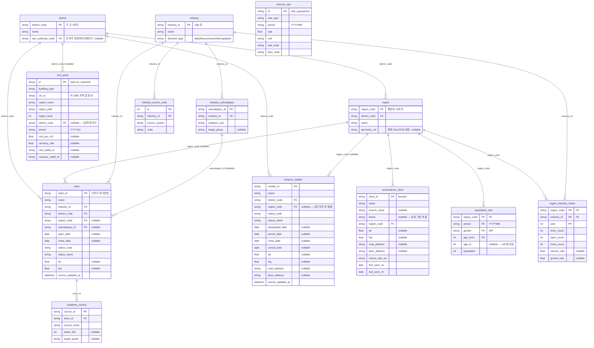
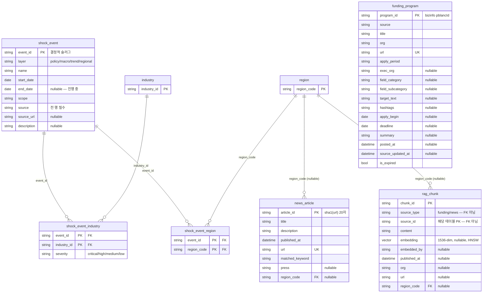
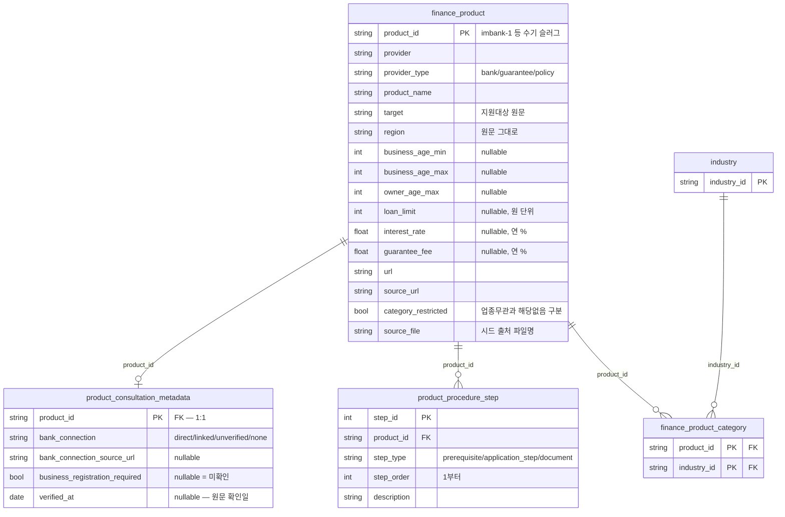
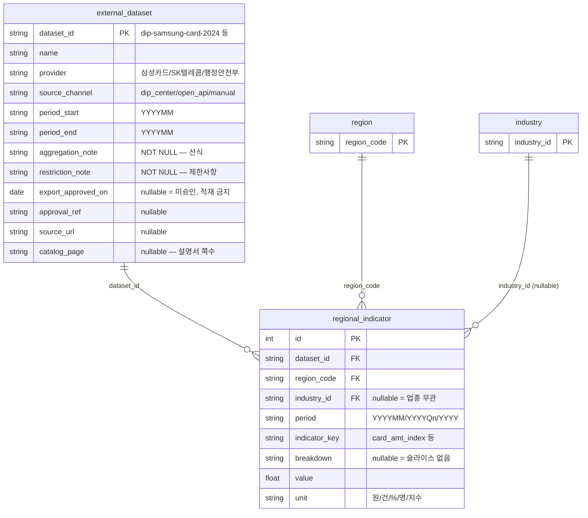
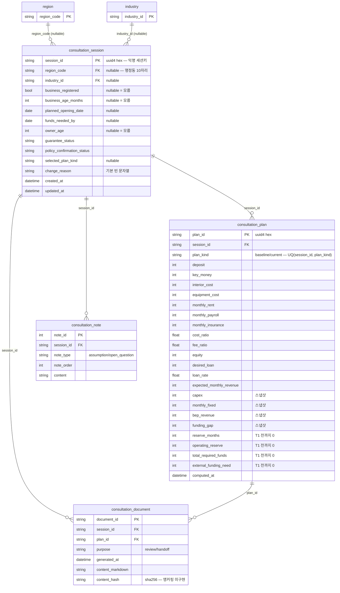

# ERD — localhostdaegu 백엔드 스키마 (29테이블)

> 작성: 2026-09-18
> 근거: `backend/apps/**/adapter/outbound/orms/*_orm.py` **29파일 실제 코드**와 alembic head `b93358fab70e`.
> 설계 스펙: [스키마 마이그레이션 설계](superpowers/specs/2026-09-18-schema-migration-design.md) · 규칙: [`backend/CLAUDE.md` §13 ERD 설계 규칙](../backend/CLAUDE.md)
> **스펙과 코드가 다르면 코드가 진실이다.** 이 문서의 컬럼명·FK·인덱스는 ORM 파일에서 직접 읽은 값이다.

## 0. 이 문서를 읽는 법 — 자리·연결·표시는 다르다

[문제 정의 §8-1](problem.md)은 **자료 적재 / 계산 경로 연결 / 화면 표시**를 각각 구분한다. 스키마 문서도 같은 구분을 쓴다.

| 단계 | 뜻 | 이 문서의 표기 |
|---|---|---|
| ① 스키마 | 테이블·컬럼·FK가 존재한다 | 아래 §2~§3 전부 |
| ② 적재 | 그 테이블에 실제 행이 있다 | §7 적재 상태 열 |
| ③ 연결 | 계산·API 경로가 그 행을 읽는다 | §7 동선 연결 열 |
| ④ 표시 | 화면이 그 값을 보여준다 | §7 화면 표시 열 |

**테이블이 있다는 사실은 데이터가 있다는 뜻이 아니다.** 특히 `external_dataset`·`regional_indicator`는 **빈 테이블**이며, 대구 빅데이터 활용센터 D1(삼성카드)·D2(SKT)는 **미신청·미확보** 상태다([이어받기 §0-3](handoff.md)). 이 두 테이블의 존재를 "센터 데이터 연동"으로 설명하지 않는다.

## 1. 테이블 지도 (29)

| 그룹 | 테이블 | 비고 |
|---|---|---|
| 마스터 허브 (5) | `district` · `region` · `industry` · `industry_subcategory` · `industry_source_code` | 대구 8구·군, 144행정동, 업종 마스터 |
| 점포·집계 (5) | `store` · `academy_course` · `tobacco_retailer` · `convenience_store` · `region_industry_metric` | 인허가 원천 + 행정동×업종×연도 집계 |
| 통계 (3) | `population_stat` · `rent_price` · `interest_rate` | 인구·임대시세·금리 시계열 |
| 충격 (3) | `shock_event` · `shock_event_industry` · `shock_event_region` | 외생 충격 4계층 |
| 문서·RAG (3) | `funding_program` · `news_article` · `rag_chunk` | 정책자금 공고·뉴스·임베딩 청크 |
| **금융상품 (신규 4)** | `finance_product` · `finance_product_category` · `product_consultation_metadata` · `product_procedure_step` | 수기 JSON 12건의 DB 정본 |
| **외부 데이터셋·지표 (신규 2)** | `external_dataset` · `regional_indicator` | 센터 반출 결과를 받을 자리 (현재 0행) |
| **상담 (신규 4)** | `consultation_session` · `consultation_plan` · `consultation_note` · `consultation_document` | 익명 사전상담 세션 |

기존 19 + 신규 10 = **29**. 신규 10개는 alembic 리비전 `b93358fab70e`(down_revision `66a23fb0c6e9`)가 `create_table` 10 + `create_index` 8로만 추가했다. **기존 19테이블에 대한 `alter_column`·`drop_*`은 0건**이다.

## 2. 그룹별 ER 다이어그램

그룹 간 엣지를 보이게 하려고 허브 테이블(`region`·`industry`·`district`)은 §2-1 밖 다이어그램에도 컬럼 없이 다시 등장한다. 전체 엣지 목록은 §3 표가 정본이다.

### 2-1. 마스터 허브 · 점포 · 집계 · 통계



`interest_rate`는 위 다이어그램 안에 있지만 **어떤 엣지도 없다.** §4를 보라.

### 2-2. 충격 · 문서 · RAG



`funding_program`은 위 다이어그램 안에 있지만 **어떤 엣지도 없다.** §4를 보라.

### 2-3. 금융상품 (신규)



### 2-4. 외부 데이터셋 · 지표 (신규, 현재 0행)



### 2-5. 상담 (신규)



## 3. 연결(엣지) 전체 표

`backend/CLAUDE.md` §13 **연결 원칙**(모든 테이블이 노드·엣지로 연결, 고립 금지) 충족 여부를 테이블 단위로 검사한 결과다. 아래 FK 목록은 SQLAlchemy 메타데이터를 그대로 덤프한 값이며 리비전 `b93358fab70e`의 `ForeignKeyConstraint` 선언과 일치한다.

| 테이블 | 나가는 FK | 들어오는 FK | 근거 |
|---|---|---|---|
| `district` | — | `region` · `store` · `tobacco_retailer` · `rent_price` | 허브 최상위. 구·군 5자리 |
| `region` | `district_code` → `district` | `store` · `tobacco_retailer` · `convenience_store` · `population_stat` · `region_industry_metric` · `shock_event_region` · `news_article` · `rag_chunk` · `regional_indicator` · `consultation_session` (10건) | 행정동 10자리 — 공간 분석의 단일 기준축 |
| `industry` | — | `industry_subcategory` · `industry_source_code` · `store` · `region_industry_metric` · `shock_event_industry` · `finance_product_category` · `regional_indicator` · `consultation_session` (8건) | 업종 마스터 |
| `industry_subcategory` | `industry_id` → `industry` | `store.subcategory_id` | 학원 교습계열 등 세분 축 |
| `industry_source_code` | `industry_id` → `industry` | — | 업종 ↔ 원천코드 매핑 |
| `store` | `industry_id`, `district_code`, `region_code`(nullable), `subcategory_id`(nullable) | `academy_course` | 인허가 단위 점포 원천 |
| `academy_course` | `store_id` → `store` | — | 학원 store 1:N |
| `tobacco_retailer` | `district_code`, `region_code`(nullable) | — | docstring: "district FK(필수) + region FK(공간조인 후 채움, nullable)로 마스터 허브에 연결 — 고립 없음" |
| `convenience_store` | `region_code` → `region` | — | docstring: "§13 연결 원칙: region FK 필수(요청 행정동 — adongCd 프리픽스 유일 실측)로 허브 연결" |
| `region_industry_metric` | `region_code`, `industry_id` (둘 다 PK) | — | 집계 계층. store에서 배치 재생성 |
| `population_stat` | `region_code` → `region` (PK 일부) | — | 행정동×연월×성별×연령 long format |
| `rent_price` | `district_code` → `district` (**nullable, 의도된 미연결**) | — | docstring: R-ONE 지역 단위가 자치구가 아니라 상권/권역/시도 — "매핑은 후속" |
| `interest_rate` | **없음** | **없음** | **FK 고립 — §4** |
| `shock_event` | — | `shock_event_industry` · `shock_event_region` | 자식 2개로 연결 |
| `shock_event_industry` | `event_id`, `industry_id` | — | 충격×업종 M:N |
| `shock_event_region` | `event_id`, `region_code` | — | 충격×행정동 M:N (현재 0행) |
| `funding_program` | **없음** | **없음** | **FK 고립 — §4** |
| `news_article` | `region_code`(nullable) → `region` | — | docstring: "event_id FK는 shock_event BC 생성 시 추가" — 아직 없음 |
| `rag_chunk` | `region_code`(nullable) → `region` | — | `source_type`+`source_id`는 `funding_program`·`news_article`을 가리키지만 **FK가 아니다**(다형 참조) |
| `finance_product` | — | `finance_product_category` · `product_consultation_metadata` · `product_procedure_step` | 상품 애그리게이트 루트 |
| `finance_product_category` | `product_id`, `industry_id` (둘 다 PK) | — | 상품×업종 M:N — 상품 그룹을 `industry` 허브에 연결하는 유일한 엣지 |
| `product_consultation_metadata` | `product_id` (PK=FK) | — | 1:1. 행이 없으면 "미확인" |
| `product_procedure_step` | `product_id` (index) | — | 1:N. UQ(product_id, step_type, step_order) |
| `external_dataset` | — | `regional_indicator` | provenance 저장소 |
| `regional_indicator` | `dataset_id`, `region_code`, `industry_id`(nullable) | — | 데이터셋·허브 양쪽에 연결 |
| `consultation_session` | `region_code`(nullable), `industry_id`(nullable) | `consultation_plan` · `consultation_note` · `consultation_document` | 상담 애그리게이트 루트 |
| `consultation_plan` | `session_id` (index) | `consultation_document.plan_id` | UQ(session_id, plan_kind) |
| `consultation_note` | `session_id` (index) | — | UQ(session_id, note_type, note_order) |
| `consultation_document` | `session_id`, `plan_id` | — | 어떤 선택안으로 만든 자료인지 함께 기록 |

**신규 10테이블은 전부 연결돼 있다.** 상품 4개는 `finance_product` → `finance_product_category` → `industry`로, 데이터셋·지표 2개는 `regional_indicator` → `region`/`industry`/`external_dataset`로, 상담 4개는 `consultation_session` → `region`/`industry`로 허브에 닿는다.

## 4. 고립 테이블 — 실제로 2건 있다

§13은 *"어떤 테이블도 고립된 채로 존재할 수 없다"*고 규정한다. 29테이블 중 **FK 엣지가 양방향 모두 0인 테이블이 2건** 있다. 숨기지 않고 적는다.

| 테이블 | 상태 | 애플리케이션 계층의 실질 연결 | 판단 |
|---|---|---|---|
| `interest_rate` | FK 0 (in·out 모두) | ORM docstring이 명시적으로 인정한다: *"상권과 무관한 전국 공시 데이터 — region/industry와 직접 엣지 없이 계산기 유스케이스에서 `rent_price`와 애플리케이션 조인한다."* `GET /shocks/rates/latest`가 시뮬레이터 대출금리 기본값을 프리필한다 | **의도된 미연결.** 전국 단위 시계열이라 어느 허브 키에도 함수 종속되지 않는다. 억지로 `region`을 붙이면 144행정동 × 기간만큼 같은 값을 복제하게 되어 3NF 위반이다 |
| `funding_program` | FK 0 (in·out 모두) | `rag_chunk.source_type='funding'` + `source_id=program_id`가 실질 참조지만 다형 참조라 FK를 걸 수 없다. ORM docstring: *"업종 M:N(`funding_program_industry`)은 LLM 구조화 추출 후속 작업에서 추가"* | **미완 설계.** 공고 본문에서 지역·업종을 구조화 추출하면 `funding_program_region`·`funding_program_industry`로 허브에 연결할 수 있다. 후속 과제 |

**둘 다 이번 마이그레이션이 만든 테이블이 아니다.** 기존 19테이블에 속하며 이번 범위는 additive였다(§8). 고립 해소는 별도 작업으로 남긴다.

`rent_price`는 `district_code`가 nullable이지만 FK 선언은 있으므로 고립이 아니다. 다만 **실제 행에서 값이 채워지지 않은 의도된 미연결**임을 docstring이 밝히고 있어, 조인 가능성은 스키마가 아니라 후속 상권→자치구 매핑에 달려 있다.

## 4-1. 비어 있는 테이블 3건 — 의도된 0행과 미사용 (2026-09-19 실측)

| 테이블 | 행 수 | 왜 비어 있나 | 판단 |
|---|---|---|---|
| `shock_event_region` | 0 | 충격 이벤트 29건이 전부 시 단위(정책·거시·추세)라 업종 M:N(`shock_event_industry` 147행)만 채워졌다. 지역 층(`layer=regional`)은 특정 시장 화재·구 단위 방역처럼 행정동을 한정하는 사건이 생길 때만 채운다 | **정상.** 채울 사건이 없으면 0행이 맞다. 시드 CLI(`seed_shock_events`)가 `region_codes`를 받는 경로는 열려 있다 |
| `finance_product_category` | 0 | 상품 12건이 `category` 단일 값으로 충분해 M:N 카테고리를 쓰는 코드 경로가 없다(리포지토리·ORM 매퍼만 참조) | **미사용.** 상품이 다중 카테고리를 갖게 되기 전까지 비워 둔다. 지우지 않는 이유는 additive 마이그레이션 원칙(§8) |
| `consultation_document` | 0 | 상담자료 문서 해시 기록 — 사용자가 "상담자료 저장"을 눌러야 생긴다 | 기능은 배선됨(9/18). 운영 데이터 유입 대기 |

같은 날 실측으로 §1·§2-4의 "현재 0행" 표기는 옛 것이다: `external_dataset` 5행(공공데이터 5종 메타)·`regional_indicator` 2,933행(9/19 적재). 테이블 수도 어린이집 2테이블(`childcare_center`·`childcare_center_stat`, 마이그레이션 `d2e3f4a5b6c7`)이 더해져 **31**이다 — 본문 "29"는 9/18 기준.

## 5. 역정규화 근거 표

§13은 *"부분적 역정규화는 허용하되 반드시 명시적 근거"*를 요구한다. 근거는 전부 ORM docstring에서 인용한다.

| 항목 | 무엇이 중복인가 | ORM docstring 인용 | 왜 허용하는가 |
|---|---|---|---|
| `region_industry_metric` 전체 | `store`의 `open_date`·`close_date`에서 전량 재계산 가능한 파생값(`store_count`·`open_count`·`close_count`·`closure_rate`·`growth_rate`) | *"행정동×업종×연도 집계 지표 — store 원천에서 배치 재생성 (역정규화 허용 계층)"* | 단계구분도(`GET /metrics`)가 전 행정동×업종×연도를 훑는다. 161,115행 `store`를 요청마다 집계하면 지도가 멈춘다. **집계 계층은 원천에서 재생성 가능하므로 소실돼도 복구된다** |
| `convenience_store.brand` | `name`(상호명)에서 문자열 추출한 값 | *"brand: 상호 기반 추출 — 미확인 None (역정규화: 브랜드 분포 조회 축)"* | 브랜드 분포 조회를 상호 LIKE 스캔으로 매번 하지 않기 위한 조회 축. 추출 실패는 NULL로 남겨 **추정값과 원문을 섞지 않는다** |
| `consultation_plan`의 결과 8필드 (`capex`·`monthly_fixed`·`bep_revenue`·`funding_gap`·`reserve_months`·`operating_reserve`·`total_required_funds`·`external_funding_need`) | 같은 행의 `FinanceInput` 13필드에서 재무 엔진이 계산하는 값 | *"계산 결과 8필드는 감사·재현용 스냅샷이다. 전환계획 §5-3 '클라이언트가 보낸 계산 결과를 리포트의 기준으로 삼지 않는다' — 리포트 경로는 13필드로 서버에서 재계산한다"* | 당시 어떤 수치를 보고 결정했는지 재현하려면 스냅샷이 필요하다. **읽기 금지 제약이 코드에 함께 박혀 있다** — `consultation_repository.py` 클래스 docstring, `consultation_port.py:16`, `consultation_entity.py:63`·89 |
| `finance_product.category_restricted` | `finance_product_category` 행 수 0/N에서 유도되는 듯 보이는 불리언 | *"JSON category의 None(업종 무관) ↔ [](해당 업종 없음) 구분 보존"* / 자식 ORM: *"행이 없는 것만으로는 '업종 무관'과 '해당 업종 없음'을 구분할 수 없다"* | **유도 불가능하므로 사실은 역정규화가 아니다.** 자식 0행이 두 가지 뜻을 가지므로 판별자 컬럼이 필요하다. §6-2 참조 |
| `consultation_session`의 프로필 인라인 | 별도 `consultation_profile` 테이블로 뺄 수 있는 8필드 | *"프로필(1:1 인라인, 3NF 위반 아님 — 전 필드가 session_id에 완전 함수 종속)"* | 세션과 1:1 필수 동반이며 모든 필드가 `session_id`에 완전 함수 종속이다. 분리하면 항상 JOIN이고 §12 fractal set만 한 벌 늘어난다 |
| `rent_price`의 `region_name`·`region_path`·`region_level` | R-ONE `cls_id`에 함수 종속인 지역명 | *"지역 단위는 자치구가 아니라 R-ONE 상권/권역/시도… 원천 지역명을 보존하고 district FK는 nullable"* | R-ONE 지역 분류 마스터 테이블이 없다. 원천 문자열을 보존하지 않으면 표본 개편 시 과거 행의 의미를 잃는다 |

## 6. 신규 테이블의 설계 판단

### 6-1. `regional_indicator` — long format

지표 하나마다 컬럼을 두는 wide format 대신 `(indicator_key, breakdown, value, unit)` 4컬럼 long format을 택했다.

> *"확보계획 §3은 D1·D2 반출 형태를 '센터가 승인하는 동등한 형식'으로만 규정하며 승인 결과가 컬럼 단위로 확정되지 않았다. 지표별 전용 테이블을 지금 만들면 승인 형태가 다를 때 마이그레이션을 다시 짜야 한다. long format은 D3~D5·후속 반출까지 마이그레이션 없이 받는다."* — `regional_indicator_orm.py`

전례도 있다. `population_stat`이 같은 형태다(*"행정동×연월×성별×연령구간 … long format"*).

**`region_industry_metric`과 합치지 않는 이유:** 확보계획 §6이 카드 소비 변화율을 인허가 `growth_rate`에 덮어쓰는 것을 금지한다. *"테이블을 나누면 구조적으로 보장된다."* 같은 테이블에 두면 어느 산식의 값인지 컬럼 주석에만 의존하게 된다.

### 6-2. `category` 3상태 보존 (None / [] / [...])

`apps/matching/domain/matcher.py`의 기존 판정은 `if p["category"] is not None and category not in p["category"]: return False`다. 즉 `None`=업종 무관 통과, `[]`=전부 탈락. DB 왕복이 이 의미를 바꾸면 매칭 결과가 조용히 달라진다.

| JSON `category` | `finance_product.category_restricted` | `finance_product_category` 행 | 매칭 |
|---|---|---|---|
| `None` (업종 무관) | `False` | 0건 | 모든 업종 통과 |
| `[]` (해당 업종 없음) | `True` | 0건 | 모든 업종 탈락 |
| `["cafe", …]` | `True` | N건 | 해당 업종만 통과 |

자식 행 0건이 2·3행 모두에서 나타나므로 **판별자 컬럼 없이는 복원 불가능**하다. `matcher.match_products`는 수정하지 않았다.

실측: 상품 12건 시드 후 `load_all_products()`가 돌려준 **15필드 dict가 JSON 폴백 경로와 완전히 동일**했고, `category` 3상태가 모두 구분돼 왕복했다.

### 6-3. 상품 메타데이터 1:1 분리

`product_consultation_metadata`를 `finance_product`에 인라인하지 않은 이유는 **수명주기가 다르기 때문**이다. `verified_at`(원문 확인일)·`bank_connection`은 조사 산출물(`docs/research/finance-products/`)과 함께 갱신되고, 상품 식별정보는 그렇지 않다. *"행이 없으면 '미확인'이다"* — NULL 8개를 채우는 대신 행 부재로 미확인을 표현한다. 현재 12건은 **메타데이터 행 없이** 적재돼 있다.

`bank_connection` 허용값은 도메인 상수 `BANK_CONNECTIONS`가 정하고 리포지토리 쓰기 경로가 검증한다. *"DB CHECK 제약은 두지 않는다 — 값 추가가 마이그레이션을 유발하지 않게 한다."*

### 6-4. `NULLS NOT DISTINCT`

PostgreSQL 기본 동작(`NULLS DISTINCT`)에서는 NULL을 포함한 행이 UNIQUE에 걸리지 않는다. `regional_indicator`는 `industry_id`(업종 무관 지표)와 `breakdown`(슬라이스 없음) 둘 다 NULL이 정상이므로, 기본 동작이면 같은 지표가 조용히 여러 번 쌓여 값이 갈린다.

D가 실측한 적용 DDL:

```sql
CREATE UNIQUE INDEX ... ON public.regional_indicator
    USING btree (dataset_id, region_code, industry_id, period, indicator_key, breakdown)
    NULLS NOT DISTINCT
```

ORM 선언은 `UniqueConstraint(..., postgresql_nulls_not_distinct=True)`이고, 마이그레이션도 같은 인자를 그대로 내보냈다. PostgreSQL 17(`pgvector/pgvector:pg17`)이므로 PG15+ 요건을 만족한다.

### 6-5. `product_procedure_step` — 판별자 1테이블

`prerequisites`·`application_steps`·`documents` 세 리스트를 테이블 3개로 쪼개지 않았다. *"세 리스트가 (순서, 문자열)로 구조·접근이 같아 판별자 1테이블로 둔다."* 테이블 3개는 §12 fractal 11-file set 3벌을 요구하므로 과설계다. 빈 준비서류는 행 0건이며 화면에서 "공식 안내에서 준비서류 확인 필요"로 표시한다.

### 6-6. `external_dataset`의 NOT NULL 두 개

`aggregation_note`·`restriction_note`가 NOT NULL인 것이 이 테이블의 존재 이유다.

> *"산식과 제한사항을 nullable로 두면 출처 없는 지표를 넣는 경로가 생기고, 화면에 뜬 숫자가 무엇을 센 값인지 되짚을 수 없게 된다. 비워 둘 수 없게 만들어 구조로 강제한다."*

`export_approved_on`이 NULL이면 미승인이며, `regional_indicator_repository.py`의 `_assert_export_approved()`가 적재를 거부한다 — *"미등록·미승인 데이터셋을 걸러낸다."*

## 7. 적재·연결·표시 상태 (미연결 테이블 표기)

§0의 4단계 구분을 테이블에 적용한다. **스키마가 있다는 것과 새 창업자금 사전상담 동선이 그 값을 쓴다는 것은 다르다.**

| 테이블 | ② 적재 | ③ 계산 경로 연결 | ④ 화면 표시 | 비고 |
|---|---|---|---|---|
| `shock_event` | 있음 (대구 타임라인, 9/18 devlog 기준 22 → 29) | ❌ 사전상담 동선 밖 | ❌ | 리포트의 충격 섹션은 뉴스 RAG 검색을 쓴다([이어받기 §0-2-1](handoff.md)) |
| `shock_event_industry` | 있음 | ❌ | ❌ | 위와 동일 |
| `shock_event_region` | **0건** | ❌ | ❌ | ④계층 감지는 후속 |
| `tobacco_retailer` | **0건** | ❌ | ❌ | 대구 수집기 없음(수동 파일 필요) |
| `convenience_store` | **0건** | ❌ | ❌ | 서울 원본 잔재 — 대구 수집기 없음 |
| `academy_course` | **0건** | ❌ | ❌ | 서울 원본 잔재 |
| `rent_price` | 786건 | ❌ `apps/rent` 안에서만 참조 | ❌ | 월세 자동 입력 미구현, 초기값 0 |
| `population_stat` | 48,174건 | ❌ 적재 CLI·ORM에만 참조 | ❌ | 인구 카드 미구현 |
| `external_dataset` | **0건** | ❌ | ❌ | **D1 삼성카드·D2 SKT 미신청·미확보** |
| `regional_indicator` | **0건** | ❌ | ❌ | CSV 로더 CLI만 있고 데이터가 없다 |
| `consultation_session`·`_plan`·`_note`·`_document` | 테스트 외 **0건** | ⚠️ 백엔드 POST/GET 왕복만 동작 | ❌ | **프론트엔드는 여전히 `sessionStorage`다.** API 전환은 후속 |
| `finance_product` 외 3 | 상품 12건 시드 가능 | ✅ `GET /matching`이 DB 우선·JSON 폴백으로 읽음 | ✅ 매칭 카드 | `finance_product_category`·`product_consultation_metadata`·`product_procedure_step`은 현재 0행 |
| `interest_rate` | 365건 | ✅ `GET /shocks/rates/latest` → 시뮬레이터 프리필 | ✅ | FK는 고립(§4) |
| `funding_program`·`news_article`·`rag_chunk` | 1,641 / 1,446 / 3,056 | ✅ `/analysis` RAG | ✅ 인용 | 건수는 9/18 기준 |
| `store`·`region_industry_metric`·마스터 5 | 적재 완료 | ✅ 지도·요약·위험도 | ✅ | |

**하지 않아야 할 표현:**

- `regional_indicator` 스키마 존재를 "센터 데이터 연동 완료"로 쓰지 않는다. **미신청·미확보·0행**이다.
- `consultation_*` API 존재를 "프론트가 서버 세션을 쓴다"로 쓰지 않는다. 프론트는 `sessionStorage`다.
- `consultation_document.content_hash` 존재를 "블록체인 앵커링 구현"으로 쓰지 않는다. **미구현**이며 [문제 정의 §8-1](problem.md)이 선택·후속 항목으로 둔다.
- `consultation_plan.reserve_months`·`operating_reserve`·`total_required_funds`·`external_funding_need`를 계산 결과로 읽지 않는다. **재무 엔진(`engine.py`)은 이번에 수정되지 않았고 T1 구현 전까지 0이다.** 읽기 금지 제약이 코드 docstring에 있다.

## 8. 교차 BC 엣지 1건 — `apps/matching` → `apps/product`

`backend/CLAUDE.md` §11은 BC 완전 분리를, §7은 *"Business logic imports Ports, never Adapters"*를 규정한다. 이번 작업에서 **규칙상 약한 지점 1건**이 생겼다.

`apps/matching/adapter/outbound/gateways/manual_product_gateway.py`가 다른 BC의 것을 직접 import한다:

```python
from apps.product.adapter.outbound.repositories.finance_product_repository import (
    SqlAlchemyFinanceProductRepository,          # ← 다른 BC의 Adapter
)
from apps.product.app.ports.output.finance_product_port import FinanceProductRepositoryPort
from apps.product.domain.entities.finance_product_entity import FinanceProduct   # ← 다른 BC의 Entity
```

**약한 이유:** `SqlAlchemyFinanceProductRepository`는 Port가 아니라 Adapter다. §7의 "never Adapters"에 걸린다. `FinanceProduct` 엔티티가 matching BC 안으로 들어오는 것도 §11의 모델 분리에 어긋난다.

**완화 요인 (실제 코드에 있다):**

1. `_to_dict()`가 **ACL(Anti-Corruption Layer) 역할**을 한다 — §10 DDD의 *"Use an ACL at the seam to prevent external models from polluting yours."* product BC의 `FinanceProduct` 엔티티는 이 함수 안에서 기존 15필드 dict로 변환되고, matching 도메인(`matcher.match_products`)은 dict만 본다. 외부 모델이 matching 도메인까지 침투하지 않는다.
2. `load_all_products_from(repository: FinanceProductRepositoryPort)`로 **Port 타입을 받는 seam이 분리돼 있다.** Adapter를 직접 부르는 곳은 `load_all_products()` 한 줄(합성 지점)뿐이고, 테스트는 seam으로 DB 없이 두 경로를 검증한다.
3. 위치가 `adapter/outbound/gateways/`다 — 도메인이 아니라 어댑터 계층이다.

**후속 정리 과제로 남긴다.** 정식 해소는 matching BC가 자기 Port(`ProductCatalogPort` 등)를 정의하고 product BC의 리포지토리를 조립 루트에서 주입하는 형태다. 이번 범위에서 **코드는 고치지 않았다** — 코드 프리즈 전 `GET /matching` 응답을 흔들지 않는 것이 우선이다.

## 9. 마이그레이션·검증 사실

| 항목 | 실측 |
|---|---|
| 리비전 | `b93358fab70e` (down_revision `66a23fb0c6e9`) |
| 연산 | `create_table` **10** + `create_index` **8**. 기존 19테이블에 대한 `alter_column`·`drop_*` **0건** |
| `alembic check` | `No new upgrade operations detected.` (ORM ↔ 마이그레이션 일치) |
| 다운그레이드 | 왕복 성공 — FK 순서 오류 없음 |
| `rag_chunk` HNSW 인덱스 | **drop되지 않음** (ORM에 동일 선언이 있어 autogenerate가 제안하지 않음) |
| 전체 테스트 | **392 passed, 1 skipped** — 상품 시드가 **있는 상태와 없는 상태 양쪽**에서 확인 |
| 순서·상태 의존 | `tests/test_matching.py`를 `load_all_products_from()` seam으로 고쳐 해소 |

**검증 범위 제한:** 위 마이그레이션은 **테스트 DB에서만 검증했다.** 개발 DB(포트 5437, `localhostdaegu`)는 여전히 `66a23fb0c6e9`·**20테이블**(업무 19 + `alembic_version`) 그대로이며 이번 리비전이 적용되지 않았다.

## 10. 참조

| 무엇 | 어디 |
|---|---|
| 설계 확정안 | `docs/superpowers/specs/2026-09-18-schema-migration-design.md` |
| ERD 규칙 (정규화·연결 원칙·Fractal) | `backend/CLAUDE.md` §13 |
| 적용 리비전 | `backend/migrations/versions/b93358fab70e_product_dataset_indicator_consultation_.py` |
| ORM 등록 목록 (29) | `backend/migrations/env.py` |
| 센터 데이터 미확보 상태 | `docs/handoff.md` §0-3 |
| 적재/연결/표시 구분의 출처 | `docs/problem.md` §8-1 |
